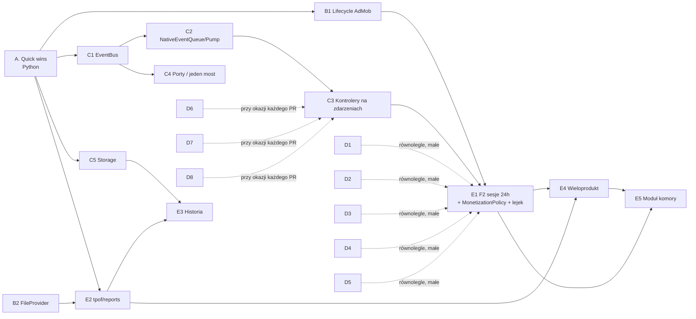

# Audyt architektury, kodu i produktu — 2026-09-05

Rola audytora: Senior Software Architect + Staff Engineer + Product Engineer +
Code Reviewer. Audyt obejmuje rzeczywisty kod, nie README. Zapis przebiegu
sesji, decyzji i ustaleń z etapu publikacji (w tym blokada pipeline'u APK):
[`AUDIT_SESSION_2026-09-05.md`](AUDIT_SESSION_2026-09-05.md).

## Zakres i metoda

- Repozytorium: `S3bx0/shockercalc`, gałąź `main`, commit `27bb34a`
  (tag `v1.5.15`; punkt odniesienia pierwotnego raportu, nie bieżący HEAD PR).
- Przeczytano w całości: `tpof/core`, `tpof/labor`, `tpof/mobile/app.py`,
  `app_controllers.py`, `entitlements.py`, `user_data.py`, `currency.py`,
  `settings_state.py`, `telemetry.py`, `android_bridge.py`, `pdf_export.py`,
  `localization.py`, `navigation.py`, `shell.py`, `catalog.py`,
  `product_labels.py`, `accessibility.py`, `form_interactions.py`,
  `constants.py`, `paths.py`, koordynatory i workflowy w `tabs/`, kontrolery w
  `dialogs/` i `services/`, wszystkie klasy w `android/src/`, konfigurację
  buildu i CI (`buildozer.spec`, `pyproject.toml`, `.github/workflows/*`,
  `p4a_hooks.py`), wybrane testy oraz dokumenty w `docs/`.
- Pomiary wykonane lokalnie (nie z dokumentacji):
  - `pytest -p no:cacheprovider --no-cov` → **500 passed in 5.05 s**;
  - klucze i18n: PL 253 / EN 253, brak różnic zbiorów;
  - `assets/Table3.json`: 19 kategorii, 215 produktów (7 technicznych rekordów
    `*_CTP ALDI` w kategorii `różne`);
  - historia Git: 223 commity od 2026-05-30 do 2026-08-09, jeden autor;
  - najczęściej zmieniane pliki w ostatnich 60 commitach: `ROADMAP.md` (22),
    `tests/test_android_build_config.py` (20), `CHANGELOG.md` (15),
    `pyproject.toml` (13), `android-release.yml` (12), `README.md` (12);
  - asercje testowe na tekście źródła (`read_text` / `in source`): ~200, w tym
    `test_mobile_smoke.py` 63 i `test_android_build_config.py` 61.
- Zasada: jeśli czegoś nie da się potwierdzić z kodu, jest to zaznaczone jako
  „nie mogę potwierdzić na podstawie obecnego kodu”.

**Weryfikacja uzupełniająca 2026-09-05:** sprawdzono cały dokument z PR #33
(`b84c2c0`), wskazane ścieżki kodu i testy, logi CI oraz dokumentację upstream.
Korekty naniesiono w miejscu błędnych tez; Część IV zawiera dowody, ograniczenia
i dodatkowe bramki. To przegląd architektoniczno-produktowy, nie pełny audyt
bezpieczeństwa ani ponowny test APK na urządzeniu. Pomiar czasu testów jest
lokalny; oceny 1–10 i rozmiary prac są oceną audytora, nie benchmarkiem.

Dokument ma cztery części:

1. **Część I — Raport** (sekcje 1–25 w formacie zamówionym przez Autora).
2. **Część II — Decyzje produktowe z 2026-09-05** i ich konsekwencje dla
   priorytetów.
3. **Część III — Mapa poprawek** (co, gdzie, jaką techniką, jaką bramką).
4. **Część IV — Weryfikacja i bramki wykonania** (stan CI, dowody, migracja,
   niezawodność, dostępność i kryteria odbioru).

Kolejność obowiązująca: Część II + III, z bramkami Części IV. Listy pomysłów
i fazy w Części I są analizą wariantów, nie dodatkową zgodą na wdrożenie.
Parametry F2 z Części II pozostają bez zmian.

---

# Część I — Raport

## 1. Executive Summary

**Co to jest.** Aplikacja Android (Kivy/KivyMD + natywna powłoka Java) z
trzema kalkulatorami inżynierskimi dla chłodnictwa: zapotrzebowanie chłodu przy
zamrażaniu produktów (baza ASHRAE, 215 produktów / 19 kategorii), dobór zaworów
dekompresyjnych i wycena robocizny. Monetyzacja freemium: 1-dniowy trial,
1 darmowy produkt na kategorię, tokeny za reklamy rewarded, subskrypcja PRO,
jednorazowy moduł zaworów. Do tego uśpiona wersja desktop (Tkinter).

**Mocne strony (potwierdzone w kodzie).**

- Czysta warstwa domenowa (`tpof/core`, `tpof/labor`) bez zależności od UI,
  z `dataclass(frozen=True)`, `Decimal` w kosztach, sensowną walidacją.
- Dekompozycja monolitu zakończona: `main.py` = 8 linii, ~30 kontrolerów bez
  importów Kivy/PyJNIus, natywna Activity = fasada (337 linii) nad 8 serwisami
  Java.
- 500 testów w ~5 s, ruff + mypy, pip-audit, Gitleaks, CodeQL, Dependency
  Review, SLSA provenance + SBOM, allowlista uprawnień, kontrola ABI/16 KB.
  To szeroki zestaw kontroli, ale ich konfiguracja nie oznacza zielonego wyniku:
  dla `b84c2c0` audyt zależności i debug APK zakończyły się błędem (IV.1).

**Najważniejsze problemy (skrót).**

1. 🟠 **Brak kanału zdarzeń Java → Python.** Stan Billing/AdMob/UMP jest
   odpytywany timerami z magicznymi opóźnieniami (0.8/3/8 s, 1/4/10 s, 1/3 s,
   1.2/3.5/7 s…). Skutek: wyścigi, stan PRO „nie łapie się”, gdy Billing łączy
   się dłużej, 12 wywołań `Clock.schedule_once` w `build()`.
2. 🟠 **Model tokenów reward jest wrogi użytkownikowi**: 1 reklama =
   1 przeliczenie; zmiana typu zaworu w dropdownie zużywa token; po reklamie
   trzeba ponownie kliknąć „Oblicz”.
3. 🟠 **`AdvertisingService` niszczy i tworzy baner oraz porzuca załadowaną
   reklamę rewarded przy zmianie aktywnej karty** — dodatkowe żądania i ryzyko
   niespójności asynchronicznych callbacków. Wpływu na fill-rate/eCPM ani
   naruszenia polityki AdMob nie zmierzono i nie potwierdzono.
4. 🟠 **Raport PDF jest wyłącznie po polsku** (`format_results_text`);
   PDF istnieje tylko dla kalkulatora chłodniczego; dwa różne generatory PDF
   (reportlab vs fpdf2).
5. 🟡 **Composition root przez 67 lambd i do 30 argumentów konstruktora** —
   testowalne, ale każde nowe zdarzenie przekrojowe wymaga przewleczenia
   kolejnej lambdy przez 3–5 klas; kolejność inicjalizacji jest load-bearing.
6. 🟡 **~200 asercji testowych na tekście źródła** — zamrażają implementację,
   nie zachowanie.
7. 🟡 **Ryzyko przewagi prac utrzymaniowych**: w ostatnich 60 commitach najczęściej
   zmieniane pliki to `ROADMAP.md`, `test_android_build_config.py`,
   `CHANGELOG.md`, `pyproject.toml`. Sama częstość zmian plików nie dowodzi
   stagnacji produktu: doszły m.in. rozbudowany feedback, skróty i poprawki UI.
   Brak danych o wpływie tych zmian na użytkowników i konwersję.

**Werdykt.** Nie przepisywać. Architektura jest zdrowa i gotowa na ewolucję.
Priorytet: najpierw przywrócenie działających bramek CI (IV.1), potem
(a) kanał zdarzeń natywnych dla monetyzacji,
(b) naprawa modelu monetyzacji i ad-lifecycle, (c) jeden wielojęzyczny silnik
raportów dla 3 kalkulatorów, (d) dopiero potem nowe funkcje (historia obliczeń,
obliczenia wieloproduktowe, moduł obciążenia komory).

## 2. Co robi aplikacja

| Funkcja | Wejście | Logika | Wyjście |
|---|---|---|---|
| **Kalkulator chłodniczy** | kategoria → produkt (wyszukiwarka, ostatnie, własne), masa kg/t, T_pocz, T_konc, czas | `calculate_freezing` — 3 etapy: schładzanie (c1), przemiana (L1), domrażanie (c2); szacowanie T_zam z wilgotności gdy brak | moce kW per etap + suma, paski %, PDF |
| **Zawory dekompresyjne** | kubatura lub L×W×H, T przed/za, liczba chłodnic × przepływ, typ zaworu (2 typy) | `calculate_decompression_valves` — ΔT/min, Q = K·V·ΔT, ceil(Q/wydajność) | liczba zaworów, ΔT, przepływ |
| **Robocizna** | osoby, dni, km, autostrady, zwyżki, kontenery, koszty dodatkowe (PLN/EUR/USD) | `calculate_cost_breakdown` — dojazd dzienny vs delegacja (limit 150 km), hotele, diety, posiłki | 8 składników + suma, wykres kołowy, kursy NBP |
| **Monetyzacja** | Play Billing, AdMob, UMP | `Entitlements` (trial/free/token/moduł) + `BillingService` | PRO, moduł zaworów, tokeny |
| **Ustawienia** | waluta, auto-kursy, jednostki (tylko metric), stawki robocizny, opinia, prawne, prywatność/telemetria | `UiPreferences`, `SettingsStateController` | JSON w katalogu prywatnym |

## 3. Architecture Map

```mermaid
flowchart TB
  subgraph Android["Android (Java) – natywna powłoka"]
    ACT[RefrigerationCalcActivity<br/>fasada dla PyJNIus]
    BILL[BillingService]:::svc
    ADS[AdvertisingService]:::svc
    UMP[PrivacyConsentService]:::svc
    FB[FirebaseTelemetryService]:::svc
    FS[FileShareService]:::svc
    FBK[FeedbackService]:::svc
    SC[AppShortcutsService]:::svc
    A11Y[AccessibilityService]:::svc
    SP[(SharedPreferences<br/>shockercalc_billing)]
    ACT --> BILL & ADS & UMP & FB & FS & FBK & SC & A11Y
    BILL --> SP
    ADS --> SP
    FB --> SP
  end

  subgraph Bridge["Most (polling, brak callbacków)"]
    AB[android_bridge.AndroidActivityBridge]
    TEL[telemetry.py<br/>własny jnius bridge]
  end

  subgraph Mobile["tpof.mobile (Python, Kivy/KivyMD)"]
    APP[app.py<br/>ShockerCalcApp.build]
    COMP[app_controllers.py<br/>compose_controllers – 67 lambd]
    SHELL[shell.py / navigation / layout / theme / localization / form_interactions]
    TABS[tabs/: freezing*, valves*, labor*]
    DLG[dialogs/: settings, privacy, legal,<br/>custom_product, labor_rates]
    SVC[services/: monetization, rewarded_access,<br/>user_feedback, app_shortcuts]
    ENT[entitlements.py]
    PREF[user_data.py / settings_state.py / currency.py]
    PDF[pdf_export.py]
    APP --> COMP --> SHELL & TABS & DLG & SVC
    SVC --> ENT
    TABS --> PREF
  end

  subgraph Core["Czysta domena"]
    CORE[tpof.core: models, calculations,<br/>valves, validators, formatters, data_loader]
    LAB[tpof.labor: models, cost_calculator,<br/>config, validation]
    PDFR[pdf_report (reportlab)<br/>pdf_report_mobile (fpdf2)]
  end

  DESK[tpof.desktop (Tkinter)<br/>uśpione, tylko freezing]

  AB --> ACT
  TEL --> ACT
  SVC --> AB
  COMP --> TEL
  TABS --> CORE & LAB
  PDF --> PDFR --> CORE
  DESK --> CORE & PDFR
  PREF -. HTTPS .-> NBP[(api.nbp.pl)]
  ENT --> J1[(entitlement.json)]
  PREF --> J2[(ui_preferences.json<br/>custom_products.json<br/>exchange_rates.json)]

  classDef svc fill:#eef,stroke:#88a
```

Kierunek zależności jest poprawny (UI → domena, nigdy odwrotnie). Jedyne
„przecieki” to `telemetry.py` (drugi, równoległy most do Activity) oraz kilka
stałych AdMob zduplikowanych w Pythonie i Javie.

## 4. Repository Map

LOC poniżej oznacza **niepuste linie**, wraz z komentarzami/docstringami,
nie liczbę instrukcji. Np. Activity ma 389 linii fizycznych / 337 niepustych,
`p4a_hooks.py` 582 / 515. Liczba testów źródłowych dotyczy plików `.py`.

| Ścieżka | LOC (≈, niepuste) | Rola | Ocena |
|---|---|---|---|
| `tpof/core` | 685 | modele, obliczenia, zawory, formatowanie, 2 generatory PDF | czysta domena, dobra |
| `tpof/labor` | 333 | kalkulator robocizny (Decimal) | czysta domena, dobra; polskie stałe |
| `tpof/mobile` (bez tabs/dialogs/widgets) | ~4 300 | app, composition, shell, layout, theme, i18n (625), currency, entitlements, user_data, telemetry, bridge | dobra separacja; nadmiar lambd |
| `tpof/mobile/tabs` | 3 239 | 3 karty × (koordynator, view, workflow, results/presentation) | wzorzec mixinów, spójny |
| `tpof/mobile/dialogs` | 1 224 | 5 dialogów jako kontrolery | dobre |
| `tpof/mobile/services` | 408 | monetyzacja, tokeny, opinia, skróty | dobre, ale polling |
| `tpof/mobile/widgets` | 1 009 | toolbar, bottom_nav, wykres, tło, ikony | Kivy-only; pełnej regresji renderowania nie potwierdzono |
| `tpof/desktop` | 837 | Tkinter God-class | uśpione, PL-only |
| `android/src/…` | ~2 000 | Activity + 8 serwisów + splash | dobre |
| `tests` | 7 144 (60 plików Python) | 500 testów | istotny udział testów „na tekście” |
| `tools` | 1 607 | bramki CI (ABI, 16 KB, uprawnienia, SBOM…) | częściowo testowane |
| `p4a_hooks.py` | 515 | regexowe łaty manifestu/gradle/Java p4a | 11 testów wywołujących hooki/helpery; rozszerzyć pokrycie, nie budować od zera |
| `.github/workflows` | ~890 | debug APK, release AAB, lint, CodeQL, dep-review | szeroki zakres; bieżące awarie opisano w IV.1 |
| `docs` | ~2 900 | audyty, plany, procedury Play | dużo, część historyczna |
| `assets` | — | Table3.json, 120+ webp, font, watermark | ok |

Martwe/placeholdery: `tpof/mobile/hints.py`, `tpof/mobile/widgets/menus.py`,
`tpof/mobile/services/telemetry_ui.py` (1-linijkowe „szkielety”), stałe
`ADMOB_*` i `PRO_SUBSCRIPTION_PRODUCT_ID` w `constants.py` (0 użyć),
`TEMP_LOW_EXTREME_WARNING_C` (0 użyć), `MODULE_INSULATION` (tylko testy).

## 5. Najważniejsze przepływy danych

**A. Obliczenie chłodnicze.**
`FreezingTabView` (Kivy) → `FreezingCalculationWorkflowMixin.calculate()`
([tabs/freezing_workflow.py](../tpof/mobile/tabs/freezing_workflow.py#L133)) →
`find_product` → `RewardedAccessController.ensure_product_access()` →
`Entitlements.is_product_allowed / try_unlock_product_with_token` → parse pól →
`calculate_freezing` → `render_results` → `AccessibilityController.announce` →
`telemetry.log_event`.
Uwaga: indeks produktu do polityki free/locked liczony jest **dwa razy
różnie**: w dialogu na liście przefiltrowanej (`_mobile_product_names`, bez
rekordów `_CTP ALDI`), a w `ensure_product_access` na liście surowej
(`list_products`). Dziś się zgadza tylko dlatego, że ukryte rekordy są na końcu
kategorii „różne”.

**B. Token za reklamę (najbardziej kruchy przepływ).**
`offer_reward_ad()` → `activity.showRewardedAd()` → Java `onUserEarnedReward` →
`SharedPreferences.pending_reward_tokens++` → Python **timery 1 s i 3 s**
(`REWARD_REFRESH_DELAYS`) → `consumePendingRewardTokens()` →
`Entitlements.grant_reward_for_ad()` → `entitlement.json`. Jeśli callback
nagrody przyjdzie po wykonaniu obu timerów, pobranie nastąpi przy kolejnym
sprawdzeniu dostępu. Czas reklamy i obsługi Clock podczas pauzy nie został
zmierzony, więc nie przesądzamy, jak często zachodzi ten scenariusz.
Nie ma automatycznej kontynuacji obliczenia. Ponadto odczyt kasuje licznik
w Javie **przed** trwałym zapisem w Pythonie — ryzyko utraty nagrody (IV.3).

**C. Zakup PRO.**
`ProMonetizationController.buy()` → `launchProPurchase()` → BillingClient →
`onPurchasesUpdated` → `handlePurchase` → flaga w SharedPreferences →
`noAdsStatusChanged` (Java usuwa baner). Python nic o tym nie wie — odpytuje
`isProNoAdsActive()` po 1/4/10 s. Natywne `onResume()` odświeża Billing,
ale Pythonowe `app.on_resume()` obsługuje tylko skróty. Zatem późna odpowiedź
może pozostawić nieaktualny stan UI do kolejnego odczytu, np. restartu;
nie jest to potwierdzony pomiarem scenariusz każdej transakcji >10 s.

**D. Kursy NBP.**
`build()` → po 1 s `refresh_exchange_rates_async()` → wątek →
`get_exchange_rates(auto_update=True)` → **do 2 żądań HTTPS** (EUR, USD;
błąd pierwszego przerywa pobieranie)
niezależnie od wieku cache → `Clock.schedule_once(apply_exchange_rates)` →
przeliczenie pola kosztów dodatkowych + odświeżenie wyników.

**E. PDF.**
`PdfExportController.export()` → `build_pdf_bytes` → próba reportlab (desktop)
/ fpdf2 (Android, po `_purge_host_arch_fonttools_so()` — runtime-owe kasowanie
`.so` z bundla) → zapis do `ANDROID_PRIVATE/pdf` → `FileShareService.shareFile`
→ **kopia do publicznych Pobranych** przez MediaStore → Sharesheet.

**F. Start aplikacji.**
`_create_app_class()` (import Kivy, rejestracja fontu, `load_products`,
`merge_into` własnych) → `build()`: `compose_controllers` →
`MobileShellBuilder` → 3 karty → nawigacja → **12 miejsc wywołania
`Clock.schedule_once` w `build()`** (w tym skrót przy starcie na l. 222).
`monetization.start()` planuje dodatkowo 3 odczyty; nie należy utożsamiać
liczby miejsc w kodzie z liczbą wszystkich zaplanowanych callbacków.

## 6. Ocena obecnej architektury

**Dobre decyzje.**

- Reguła „moduł nie importuje klasy aplikacji”, typy pod `TYPE_CHECKING`, Kivy
  importowane leniwie wewnątrz `open()`/`build()`; dzięki temu 500 testów bez
  Kivy.
- Widoki jako `dataclass` z referencjami widgetów (`FreezingTabView`,
  `MobileShellView`) — czytelny kontrakt.
- Native services wyodrębnione; Activity to fasada.
- `Entitlements` w pełni testowalne z wstrzykiwanym zegarem.

**Słabe punkty.**

- **DI przez callable zamiast portów.** `FreezingTabController.__init__` ma
  30 parametrów bez `self`; `LaborTabController` 22; `app_controllers.py` ma
  388 linii fizycznych i 67 wyrażeń lambda (pomiar AST). Warto grupować
  spójne role w małe protokoły; same callbacki są prawidłowym DI, a redukcja
  liczby argumentów nie jest samodzielną miarą jakości. Protokoły
  `AndroidBillingActivity` i `AndroidRewardedAccessActivity` już istnieją.
- **Kolejność inicjalizacji jest ukrytym kontraktem.** `_settings_state`
  odwołuje się przez lambdę do `_settings_dialog_controller` tworzonego później;
  `getattr(self, "_active_tab_name", "freezing")` ×5 to obrona przed tym samym
  problemem.
- **Brak zdarzeń.** Zmiana języka/motywu/PRO/kursów jest propagowana ręcznie
  tuplami `refresh_callbacks` (`localization.py`) i lambdami — każda nowa
  powierzchnia UI musi być dopisana w 2–3 miejscach.
- **Dwa mosty do Activity** (`AndroidActivityBridge` i `telemetry._activity()`),
  oba z `autoclass + cast` przy każdym wywołaniu (`log_event` robi to per
  zdarzenie).
- **Mixiny z kontraktem przez adnotacje** (`_translate: Callable[...]` w ciele
  klasy) — MRO 5 mixinów w `FreezingTabController`; działa, ale trudno
  nawigować (metoda `calculate` zależy od `render_results` z innego mixinu przez
  `cast(Protocol)`).

## 7. Największe problemy (priorytetyzowane)

| # | Prio | Typ | Gdzie | Problem | Konsekwencja | Rozwiązanie | Zakres |
|---|---|---|---|---|---|---|---|
| 1 | 🟠 | ARCHITECTURE | `services/monetization.py:28-29`, `services/rewarded_access.py:39-40`, `app.py:248-267`, `AdvertisingService`/`BillingService` | Stan natywny odpytywany timerami; Java nie ma jak powiadomić Pythona | stan PRO/tokenów spóźniony lub zgubiony; 12 timerów przy starcie; trudne do przetestowania w czasie | Kolejka zdarzeń w Java (`ConcurrentLinkedQueue<String>` JSON) + `NativeEventPump` w Pythonie (`Clock.schedule_interval` 0.5 s) → `EventBus` | M; 6–8 plików |
| 2 | 🟠 | UX/BUSINESS BUG | `rewarded_access.py:65-94`, `tabs/valves.py` `pick_valve_type` → `calculate()` | Token zużywany przy każdym przeliczeniu; zmiana typu zaworu = kolejny token | użytkownik traci nagrodę bez intencji; iteracja parametrów nierealna | „Sesja odblokowania”: token odblokowuje produkt/moduł na czas; nie zużywać tokenu w `pick_valve_type` | S–M |
| 3 | 🟠 | PERFORMANCE / POLICY | `AdvertisingService.java` `setActiveAdTab` | `hideBanner(); attachBanner();` + `rewardedAd = null; loadRewardedAd()` przy każdej zmianie karty | nadmiar żądań reklam, porzucone załadowane reklamy, gorszy eCPM; ryzyko flagi „invalid traffic” (nie mogę potwierdzić polityki z kodu) | jeden baner; per-unit cache rewarded | S |
| 4 | 🟠 | BUG (i18n) | `core/formatters.py:14-50`, `core/pdf_report_mobile.py`, `pdf_export.py` | PDF zawsze po polsku; PDF tylko dla kalkulatora chłodniczego | użytkownik EN dostaje polski dokument; 2/3 kalkulatorów bez raportu | `ReportModel` (dane) + `render_pdf(model, lang)`; jeden silnik fpdf2 | M |
| 5 | 🟡 | BUG | `settings_state.py:139-147` + `currency.py:134-155` | `worker()` nie łapie `http.client.HTTPException` (`IncompleteRead`) | wątek pada, `_refresh_running=True` na zawsze → status „odświeżanie…”, ręczny refresh zablokowany do restartu | `try/finally` w worker; `_refresh_running` resetowany w `finally` | S |
| 6 | 🟡 | PERFORMANCE | `currency.get_exchange_rates` | Fetch przy każdym starcie, brak TTL | 2 żądania/start; NBP publikuje 1×/dzień | TTL na znaczniku pobrania | S |
| 7 | 🟡 | ARCHITECTURE | `telemetry.py:17-30` vs `android_bridge.py:31-41` | Dwa mosty PyJNIus; `autoclass` przy każdym `log_event` | niespójność, koszt JNI | `telemetry` przyjmuje `NativePlatform`; Activity cache'owana raz | S |
| 8 | 🟡 | SECURITY/UX | `FileShareService.java:43-55, 82-120` | Każdy share kopiuje PDF do publicznych Pobranych; dla API<29 `file://` + `StrictMode.setVmPolicy(new Builder().build())` | duplikaty w Pobranych, ekspozycja raportu; hack zamiast FileProvider (androidx.core już jest zależnością) | `FileProvider` + `content://`; osobna akcja „Zapisz do Pobranych” | S |
| 9 | 🟡 | TECH DEBT | `app_controllers.py`, `tabs/*/__init__` | 30-argumentowe konstruktory, ~150 lambd, kolejność inicjalizacji | wysoki koszt każdej zmiany przekrojowej | porty: `NativePlatform`, `EventBus`, `Messenger`, `ThemeProvider` | M–L, stopniowo |
| 10 | 🟡 | TECH DEBT (testy) | `tests/test_mobile_smoke.py` (63), `test_android_build_config.py` (61), + ~80 | Asercje na tekście źródła | refaktor = czerwone testy bez regresji; fałszywe poczucie pokrycia | testy zachowania z fake'ami (wzorce w `test_mobile_freezing_tab.py`) | M, iteracyjnie |
| 11 | 🟡 | DATA INTEGRITY | `user_data.py` `merge_into` | Własny produkt o nazwie istniejącego (case-insensitive) **zastępuje** rekord ASHRAE | użytkownik PRO może nadpisać dane referencyjne; brak UI usuwania/edycji | osobna przestrzeń własnych, zakaz kolizji, usuwanie | S |
| 12 | 🟡 | ARCHITECTURE | `labor/cost_calculator.py:12-13`, `labor_results.py:47-54`, `labor/validation.py:18-27` | Domena zwraca polskie stringi jako identyfikatory i komunikaty; prezenter ma własny słownik poza i18n; `travel_mode` PL trafia do Analytics | rozjazd i18n, brudne dane analityczne | `TravelMode` enum + klucze i18n; `ValidationError(code, params)` | S |
| 13 | 🟢 | TECH DEBT | `constants.py:26-32`, `hints.py`, `widgets/menus.py`, `services/telemetry_ui.py` | Martwe stałe i puste moduły | szum | usunąć | XS |
| 14 | 🟢 | TECH DEBT | `entitlements.py:67-83` vs `user_data.py:26-40`; 3× read/write JSON | Duplikat katalogu danych; 3 implementacje zapisu JSON (tylko `user_data` atomowy) | `entitlement.json` zapisywany nieatomowo → ryzyko utraty tokenów/trialu | jeden `JsonDocumentStore` (atomowy) | S |
| 15 | 🟢 | TECH DEBT | `pyproject.toml`, `buildozer.spec`, `tpof/__init__.py`, `README.md`, test | Wersja w 5 miejscach | ręczny release | `tpof/__init__.py` jako źródło; skrypt sprawdza resztę | XS |
| 16 | 🟢 | UX | `app.py` `_show_error` | Jedno „centralne powiadomienie” dla błędów, sukcesów i ostrzeżeń (`temperature_warning` pokazuje tylko pierwsze) | ostrzeżenia znikają, sukces wygląda jak błąd | `Messenger.info/warn/error`, kolejka komunikatów | S |

## 8. Security

Ocena ogólna: **dobra dla aplikacji offline bez backendu**; ryzyka są biznesowe,
nie „RCE-owe”.

| Prio | Obszar | Ustalenie | Rekomendacja |
|---|---|---|---|
| 🟡 | Uprawnienia zakupów | `BillingService.handlePurchase` nie weryfikuje `getSignature()`; uprawnienie = boolean w SharedPreferences; brak weryfikacji serwerowej | Akceptowalne przy obecnej skali. Minimalny krok bez backendu: weryfikacja podpisu RSA kluczem publicznym Play w Javie. Play Integrity dopiero przy stwierdzonych nadużyciach. |
| 🟡 | Trial i tokeny | `first_launch_ts`, `reward_tokens` w `entitlement.json`; `allow_backup=false`; czas z `time.time()` | Reset przez „wyczyść dane” lub zmianę zegara. Zaakceptować albo użyć `SystemClock.elapsedRealtime` + `PackageManager.firstInstallTime`. |
| 🟡 | Udostępnianie PDF | kopia do publicznych Pobranych przy każdym share; `file://` + globalny reset `StrictMode.VmPolicy` na API 24–28 | FileProvider; bez resetu VmPolicy. |
| 🟢 | Sieć | Tylko `api.nbp.pl` przez HTTPS z certifi; `usesCleartextTraffic=false` wymuszane hookiem; brak walidacji zakresu kursu | sanity range (np. 2–10 PLN/jedn.) |
| 🟢 | Telemetria | allow-lista parametrów, brak wartości obliczeń; `record_exception` wysyła `str(exc)[:500]` + stack (może zawierać ścieżki prywatne) | ok; ewentualnie filtrować ścieżki |
| 🟢 | Repo publiczne | e-mail kontaktowy, ID AdMob, ID produktów Play w źródle | normalne dla Androida; e-mail = ryzyko spamu |
| 🟢 | CI | akcje przypięte SHA, `pull_request` (nie `_target`), redakcja haseł w release; debug uploaduje niesanityzowany `buildozer.log` (opcjonalnie) | dodać krok redakcji do `android.yml` |
| 🟢 | Desktop PDF | hasło właściciela jawnie z `simpledialog` → `encrypt()`; „miękka” blokada (docstring to przyznaje) | ok, nie obiecywać ochrony |

Nie znaleziono podatności OWASP Top 10 klasy krytycznej (brak backendu, SQL,
WebView z JS, deserializacji nieufnych danych poza JSON z własnego katalogu).

## 9. Performance

| Prio | Ustalenie | Wpływ | Propozycja |
|---|---|---|---|
| 🟠 | Baner + rewarded odtwarzane przy każdej zmianie karty | żądania sieciowe, alokacje WebView AdMob, porzucone reklamy | jeden `AdView`, zmiana unitu tylko przy braku aktywnej reklamy; per-unit cache rewarded |
| 🟡 | 12 timerów w `build()`; `ResponsiveLayoutController.apply()` wołane z kilku | wielokrotne reflow w pierwszych 8 s | zdarzenia zamiast timerów |
| 🟡 | Kursy NBP przy każdym starcie (2 × HTTPS, timeout 5 s) | ruch, bateria | TTL |
| 🟡 | `refresh_product_search_results` przebudowuje wszystkie `OneLineListItem` na każdy znak | do 50 widgetów/klawisz | debounce 120 ms + `RecycleView` |
| 🟢 | `telemetry.log_event` → `autoclass(...)` + `cast` za każdym razem | koszt JNI per zdarzenie | cache Activity |
| 🟢 | `_purge_host_arch_fonttools_so()` skanuje bundle przy pierwszym PDF | jednorazowe opóźnienie | przenieść w całości do `p4a_hooks` |
| ? | Start Pythona na Androidzie, pamięć, ANR | **nie mogę potwierdzić z kodu** — ROADMAP wskazuje brak pomiarów bazowych | baseline `adb shell am start -W`, Android Vitals |

Obliczenia domenowe są O(1) i nie stanowią problemu.

## 10. Code Quality / Technical Debt

**Pozytywne:** ruff (E/W/F/I/B/C4/UP) i mypy zielone; typowanie w domenie
kompletne; docstringi wyjaśniają „dlaczego”; brak `print`, brak `global` poza
flagą fontu w `pdf_report.py`.

**Dług (poza §7):**

- **Nazewnictwo mieszane PL/EN w identyfikatorach domenowych**: `masa_kg`,
  `T_pocz_C`, `Q_schladzanie_kJ`, `wodaprocent`, `ilosc_zaworow` obok
  `labor_hourly_rate`, `CostBreakdown`. Nie refaktorować masowo — konwencja EN
  dla nowego kodu.
- **Broad `except Exception`**: 12 w `desktop/app.py`, 10 w
  `android_bridge.py`, 9 w `telemetry.py`, 6 w `app.py`. W moście natywnym
  uzasadnione (PyJNIus rzuca `JavaException`), ale wszędzie przechodzi w
  `log.debug` — błędy Androida są niewidoczne nawet w Crashlytics.
- **`# pragma: no cover - Android only`** na ~25 gałęziach — ścieżki produkcyjne
  sprawdzane tylko ręcznie na urządzeniu.
- **Tests as snapshot**: asercje typu
  `'"56 if landscape else 64 if compact else 70" in layout_source'` zamrażają
  literały; `test_android_build_config.py` sprawdza fragmenty Javy substringiem.
- **`p4a_hooks.py`** — regexy na `AndroidManifest.xml`, `PythonActivity.java`,
  `build.gradle`; hardkodowane wersje `google-services:4.5.0`,
  `crashlytics-gradle:3.0.7`; zero testów jednostkowych funkcji `_patch_*`.
- **Wymagania w 5 plikach** (`requirements*.txt` + `pyproject`) bez kontroli
  spójności.
- **`to_legacy_dict`** w `labor/models.py` — użycie tylko w teście.
- **`desktop/app.py`** — ~30 metod w jednej klasie, brak i18n, brak testów,
  poza mypy; ostatnia zmiana 2026-07-05 (baseline lint), CHANGELOG od 1.5.4 bez
  wpisów o desktopie. To decyzja produktowa, nie dług do spłacenia (§22, §24).

## 11. Ocena istniejących funkcjonalności

Skala 1–10. „Przebudowa”: N = nie, C = częściowo, T = tak.

| Funkcja | Implementacja | Jakość | Integracja | UX | Wydajność | Skalowalność | Testowalność | Przebudowa |
|---|---|---|---|---|---|---|---|---|
| Kalkulator chłodniczy | `core/calculations.py`, `tabs/freezing_*` | 8 | 8 | 7 | 9 | 8 | 9 | N |
| Katalog, wyszukiwarka, ostatnie, zdjęcia | `catalog.py`, `product_labels.py`, `user_data.py` | 8 | 7 | 7 | 7 | 6 | 8 | N |
| Własne produkty (PRO) | `dialogs/custom_product.py`, `CustomProductStore` | 7 | 6 | 5 (brak edycji/usuwania) | 8 | 6 | 8 | C |
| Zawory dekompresyjne | `core/valves.py`, `tabs/valves_*` | 8 | 7 | 6 (2 typy na sztywno) | 9 | 6 | 8 | C |
| Robocizna + wykres | `tpof/labor`, `tabs/labor_*` | 8 | 7 | 7 | 9 | 7 | 8 | N |
| Stawki robocizny (dialog) | `dialogs/labor_rates.py` | 7 | 7 | 6 (1 zestaw) | 9 | 6 | 8 | C |
| Waluty NBP | `currency.py`, `settings_state.py` | 7 | 7 | 7 | 6 | 7 | 9 | C (TTL, wyjątki) |
| PDF | `pdf_export.py`, `core/pdf_report*.py` | 5 | 4 | 4 | 7 | 4 | 7 | **T** |
| Entitlements | `entitlements.py` | 8 | 6 | 4 (model tokenów) | 9 | 7 | 10 | C (polityka) |
| PRO / Billing | `monetization.py`, `BillingService.java` | 7 | 5 (polling) | 6 | 7 | 6 | 8 / 0 (Java) | C |
| Reklamy / rewarded | `rewarded_access.py`, `AdvertisingService.java` | 6 | 5 | 4 | 4 | 5 | 8 / 0 | **T** (lifecycle) |
| UMP / prywatność / telemetria opt-in | `dialogs/privacy.py`, `PrivacyConsentService`, `FirebaseTelemetryService` | 8 | 7 | 7 | 8 | 8 | 8 | N |
| i18n PL/EN | `i18n.py` (253 kluczy ×2), `localization.py` | 7 | 6 | 8 | 9 | 5 | 8 | C |
| Motyw / layout / a11y | `theme.py`, `layout.py`, `accessibility.py` | 8 | 8 | 7 | 8 | 7 | 9 | N |
| Ustawienia | `dialogs/settings.py` | 7 | 7 | 6 | 8 | 7 | 8 | N |
| Opinia / Google Play | `services/user_feedback.py`, `FeedbackService` | 8 | 8 | 8 | 9 | 9 | 9 | N |
| App Shortcuts | `app_shortcuts.py`, `AppShortcutsService` | 8 | 8 | 8 | 9 | 9 | 9 | N |
| Desktop | `desktop/app.py` | 4 | 3 | 5 | 7 | 3 | 2 | decyzja (§24) |

**Do przebudowy w pierwszej kolejności:** PDF (silnik + i18n + 3 karty),
lifecycle reklam + model tokenów, integracja Billing/Ads przez zdarzenia.

## 12. Funkcje wymagające przebudowy

1. **Raportowanie PDF** — 2 silniki, PL-only, 1 karta, brak brandingu na mobile,
   runtime-owe kasowanie `.so`. Przebudowa na `ReportModel` + jeden renderer
   (fpdf2 obsługuje Unicode, obrazy i szyfrowanie → można usunąć reportlab i
   pypdf także z desktopu).
2. **Dostęp przez tokeny** — „token per przeliczenie” → „sesja odblokowania”;
   auto-kontynuacja po reklamie; nie zużywać tokenu na zmiany prezentacyjne.
3. **Lifecycle AdMob** — jeden baner, brak niszczenia przy zmianie karty.
4. **Synchronizacja stanu natywnego** — zdarzenia zamiast timerów.
5. **Własne produkty** — edycja/usuwanie, brak kolizji z katalogiem, dostępne
   także poza PRO w limicie (np. 3) jako „hak” konwersji.

## 13. Funkcje źle zintegrowane

**13.1 Stan PRO / tokenów / banera**

```text
OBECNIE:  Java (Billing/Ads callback) → SharedPreferences → [nic] … Python Clock 0.8/3/8 s → activity.isProNoAdsActive() → _apply_pro_ui_state
PROBLEM:  brak powiadomienia; timery zgadują czas odpowiedzi Play; 3 kontrolery odpytują to samo; UI potrafi się nie zaktualizować do restartu
LEPIEJ:   Java → NativeEventQueue.push({"type":"pro_changed","active":true})
          Python NativeEventPump (0.5 s) → EventBus.publish(ProStatusChanged)
          → monetization, rewarded_access, layout, localization subskrybują
```

**13.2 Telemetria**

```text
OBECNIE:  telemetry.py (własny autoclass/cast) ──► Activity      android_bridge.py ──► Activity
PROBLEM:  dwa mosty, brak jednego punktu kontroli/fake'a; log_event robi JNI lookup per zdarzenie
LEPIEJ:   NativePlatform (jeden obiekt, Protocol) → .telemetry, .billing, .ads, .share, .feedback, .a11y
```

**13.3 PDF**

```text
OBECNIE:  FreezingResults → format_results_text (PL) → [reportlab albo fpdf2] → plik → FileShareService (kopia do Pobranych)
PROBLEM:  język ignorowany; tylko freezing; dwie implementacje; publiczna kopia przy każdym share
LEPIEJ:   ReportModel(title, rows, lang, meta) ← freezing/valves/labor presenters
          render_pdf(model) [fpdf2] → cache/ → FileProvider content:// → Sharesheet; osobne „Zapisz”
```

**13.4 Komunikaty do użytkownika**

```text
OBECNIE:  wszystko → app._show_error → CenterNotice.show(text) (+ a11y announce)
PROBLEM:  sukces/ostrzeżenie/błąd nieodróżnialne; warnings[0] gubi drugie ostrzeżenie
LEPIEJ:   Messenger.info/warning/error(key, **kw) → kolejka → CenterNotice z typem i czasem
```

**13.5 Odświeżanie tekstów po zmianie języka/motywu**

```text
OBECNIE:  LocalizationController(refresh_callbacks=(6 lambd)); ThemeSyncController(apply_tab_themes=(3 lambdy))
PROBLEM:  każda nowa powierzchnia = edycja composition root w 2 miejscach
LEPIEJ:   EventBus.publish(LanguageChanged) / ThemeChanged → kontrolery subskrybują same
```

**13.6 Polityka „free product index”**

```text
OBECNIE:  dialog: index w liście przefiltrowanej   |   ensure_product_access: index w liście surowej
PROBLEM:  dwie definicje tej samej reguły
LEPIEJ:   Entitlements.is_product_free(category, name) na podstawie jednej kanonicznej listy z catalog.py
```

## 14. Jak poprawić integrację funkcji

1. **`tpof/mobile/events.py` (≈60 linii):** synchroniczny `EventBus` z
   `publish(event)` / `subscribe(type, handler)`; zdarzenia jako frozen
   dataclasses: `ProStatusChanged`, `RewardTokensChanged`,
   `ModuleOwnershipChanged`, `BannerHeightChanged`, `ExchangeRatesUpdated`,
   `LanguageChanged`, `ThemeChanged`, `ConsentChanged`. Testy bez Kivy.
2. **Kolejka natywna:** w Javie `NativeEventQueue`
   (`ConcurrentLinkedQueue<String>`, `push(type, jsonPayload)`,
   `String[] drain()`); `BillingService`, `AdvertisingService`,
   `PrivacyConsentService` pushują po callbackach. W Activity jedna metoda
   `drainNativeEvents()`. W Pythonie `NativeEventPump(platform, bus,
   schedule_interval)` — `Clock.schedule_interval(0.5)`. Dotychczasowe odczyty
   `isProNoAdsActive()` zostają jako jednorazowy „initial sync”.
3. **Porty:** `tpof/mobile/ports.py` z `Protocol`ami: `NativePlatform`,
   `Messenger`, `Scheduler`. `AndroidActivityBridge` implementuje
   `NativePlatform`; `FakePlatform` w `tests/`. Kontrolery przyjmują
   `platform`, `bus`, `messenger`, `translate`, `theme` zamiast 20 lambd —
   migrować kontroler po kontrolerze.
4. **Raporty:** `tpof/reports/model.py` (`ReportModel`, `ReportRow`),
   `tpof/reports/freezing.py|valves.py|labor.py` (presentery),
   `tpof/reports/pdf.py` (fpdf2). `format_results_text` staje się
   `render_text(model)`. Desktop i mobile używają tego samego.
5. **Storage:** `tpof/mobile/storage.py` — `JsonDocumentStore(path)` z atomowym
   zapisem; `Entitlements`, `UiPreferences`, `CustomProductStore`, cache kursów
   przyjmują store.

## 15. Brakujące funkcjonalności

**MUST HAVE**

- Raport PDF dla zaworów i robocizny; PDF w języku UI.
- Historia/zapis obliczeń (ostatnie wyniki per karta, przywracanie wejść).
- Auto-kontynuacja obliczenia po reklamie; odblokowanie na czas, nie na
  kliknięcie.
- Edycja/usuwanie własnych produktów.

**HIGH IMPACT**

- Obliczenie wieloproduktowe (komora z kilku produktów → suma mocy; eksport
  tabeli).
- Moduł obciążenia cieplnego komory / izolacji (`MODULE_INSULATION` już istnieje
  jako ID) — realny „drugi płatny moduł”.
- Parametry procesu: współczynnik bezpieczeństwa / rezerwa mocy, odszranianie —
  nie mogę potwierdzić z kodu, jakie parametry stosują docelowi użytkownicy
  (pytanie §24).
- Edytowalna lista typów zaworów (dziś 2 na sztywno w `ZAWORY`).

**UX IMPROVEMENTS**

- Rozróżnienie komunikatów (info/ostrzeżenie/błąd) i pokazywanie wszystkich
  ostrzeżeń.
- Przywracanie ostatnich wejść po restarcie.
- Kopiowanie wyniku jako tekst.
- Jednostki imperialne (odłożone świadomie — poprawnie).

**POWER USER**

- Nazwane profile stawek robocizny.
- Import/eksport własnych produktów (JSON) — także jako backup, skoro
  `allow_backup=false`.
- Tryb „porównaj 2 produkty / 2 scenariusze”.

**AUTOMATION**

- Skrypt release: wersja w 5 miejscach + CHANGELOG z jednego źródła.
- Testy jednostkowe `p4a_hooks._patch_*` na fixture'ach.
- Automatyczne sprawdzenie kompletności `PRODUCT_LABELS_EN` vs `Table3.json`.

**AI FEATURES**

- Nie proponuję. Domena jest deterministyczna (ASHRAE), użytkownik oczekuje
  powtarzalności i audytowalności.

**ADMIN / ANALYTICS**

- Ekran diagnostyczny (ukryty): stan `Entitlements`, tokeny,
  `isProNoAdsActive`, status Billing, wersja, ostatnie zdarzenia natywne, kursy
  + data.
- Lejki Analytics: `paywall_shown → ad_offered → ad_completed → token_used`,
  `pdf_shared`.

**SCALABILITY (10×/100× użytkowników)**

- Brak backendu = brak problemu skalowania serwera. Urośnie: wolumen
  Crashlytics, zapytania o zwroty, fraud zakupów, żądania nowych
  produktów/języków.
- Katalog jako wersjonowany plik ładowany z Remote Config/URL (podpisany
  SHA-256).
- Weryfikacja zakupów (Play Developer API) — gdy pojawią się dowody nadużyć.
- Trzeci język wymaga ~253 kluczy + 215 nazw produktów → pliki JSON per język i
  pomiar brakujących kluczy w CI.

## 16. Proponowane nowe funkcjonalności (karty integracji)

### F1. Kanał zdarzeń natywnych + EventBus (enabler)

- **Problem:** polling, wyścigi, spóźniony stan PRO/tokenów.
- **Użytkownik:** po zakupie PRO baner znika i przycisk zmienia się
  natychmiast; po reklamie wynik pojawia się sam.
- **Technicznie:** Java `NativeEventQueue` + `drainNativeEvents()`; Python
  `NativeEventPump` (`schedule_interval` 0.5 s) → `EventBus`.
- **Integracja:** `BillingService`, `AdvertisingService`,
  `PrivacyConsentService` (push); `monetization`, `rewarded_access`, `layout`
  (ad height), `privacy toolbar` (subskrypcja).
- **Backend/DB:** brak. **Frontend:** usunięcie ~10 timerów z `app.py`.
- **Edge-cases:** zdarzenie przed `build()` (kolejka trzyma), duplikaty
  (idempotentne handlery), recreate Activity (kolejka w statyku).
- **Bezpieczeństwo:** JSON tylko z własnej Javy; walidować typ.
- **Trudność:** M. **Wartość:** 8. **Priorytet:** P0.

### F2. Sesje odblokowania (nowy model tokenów) + auto-kontynuacja

- **Problem:** token per przeliczenie; zmiana dropdownu zużywa token; po
  reklamie trzeba klikać ponownie.
- **Użytkownik:** „Obejrzyj reklamę → produkt X odblokowany” z licznikiem;
  wynik liczy się automatycznie po powrocie.
- **Technicznie:** `Entitlements.unlock_session(scope_key, ttl_s)`;
  `ensure_product_access` sprawdza sesję zanim zużyje token; `pick_valve_type`
  nie przechodzi ponownie przez bramkę; `RewardedAccessController` pamięta
  `pending_action` i wykonuje ją po `RewardTokensChanged`.
- **Integracja:** `entitlements.py`, `rewarded_access.py`, `tabs/valves.py`,
  `tabs/freezing_workflow.py`, i18n.
- **DB:** `entitlement.json` + `sessions`. **Jobs:** brak.
- **Edge-cases:** zmiana zegara, wyjście z aplikacji w trakcie reklamy, cap
  dobowy osiągnięty po zaliczeniu reklamy (dziś gubi token).
- **Trudność:** M. **Wartość:** 9. **Priorytet:** P0. **Zależy od:** F1 (dla
  auto-kontynuacji).

### F3. Jednolity silnik raportów (PDF/tekst) dla 3 kalkulatorów, wielojęzyczny

- **Problem:** PL-only, tylko freezing, 2 silniki, kopia do Pobranych.
- **Użytkownik:** przycisk „Raport” w każdej karcie; PDF w języku aplikacji;
  „Udostępnij” albo „Zapisz”.
- **Technicznie:** `tpof/reports/`; fpdf2 wszędzie; `FileProvider` w Javie;
  nazwy plików bez polskich znaków.
- **Integracja:** `pdf_export.py`, `FileShareService.java`, `tabs/*`,
  `desktop/app.py` (zyskuje za darmo).
- **Edge-cases:** brak fontu Unicode → fallback latin-1 (istnieje), długie nazwy
  własnych produktów, brak aplikacji do udostępniania.
- **Bezpieczeństwo:** `content://` z `FLAG_GRANT_READ_URI_PERMISSION` tylko dla
  wybranej aplikacji.
- **Trudność:** M–L. **Wartość:** 8. **Priorytet:** P0/P1.

### F4. Historia obliczeń i przywracanie wejść

- **Technicznie:** `CalculationRecord(kind, inputs, outputs, ts)`;
  `HistoryStore` na `JsonDocumentStore` (limit 50, FIFO); serializacja przez
  `dataclasses.asdict`; integracja z `ReportModel` (F3).
- **Integracja:** workflowy 3 kart, nowy dialog `dialogs/history.py`, i18n,
  entitlements (historia > N wpisów = PRO? — decyzja produktowa).
- **Edge-cases:** produkt usunięty/zmieniony, zmiana stawek robocizny po zapisie
  (snapshot), zmiana waluty (koszty w PLN + waluta wyświetlania).
- **Trudność:** M. **Wartość:** 8. **Priorytet:** P1. **Zależy od:** F3,
  storage.

### F5. Obliczenie wieloproduktowe (komora)

- **Technicznie:** czysta funkcja `calculate_batch(items, T_konc, czas) ->
  BatchResults` w core (kompozycja `calculate_freezing`); podwidok w karcie
  chłodniczej.
- **Integracja:** core, `tabs/freezing_*`, reports (F3), entitlements (każda
  pozycja podlega polityce free/locked), history (F4).
- **Trudność:** L. **Wartość:** 8. **Priorytet:** P1. **Zależy od:** F2.

### F6. Moduł obciążenia cieplnego komory (izolacja, infiltracja, wentylatory)

- **Technicznie:** `tpof/core/chamber_load.py` (czysta domena; źródło danych i
  licencję potwierdzić jak w `THERMAL_DATA_AUDIT_2026-06-21.md`); nowa karta
  `tabs/chamber_*` na tym samym wzorcu; `MODULE_INSULATION` w Billing.
- **Integracja:** nawigacja, entitlements/rewarded_access (parametryzacja
  modułu — dziś `MODULE_VALVES` hardkodowany), `AdvertisingService` (nowy
  ad-unit → najpierw naprawa lifecycle), reports, i18n.
- **Trudność:** XL. **Wartość:** 9. **Priorytet:** P2. **Zależy od:** F1–F3.

### F7. Ekran diagnostyczny (admin)

- **Technicznie:** `dialogs/diagnostics.py`; czyta `Entitlements`,
  `NativePlatform`, kursy, wersję; kopiowanie do schowka; wejście przez 5× tap
  w stopkę.
- **Wartość:** 6. **Trudność:** S. **Priorytet:** P1.

### F8. Profile stawek robocizny, In-App Review, jednostki imperialne

- Zaplanowane w `ROADMAP.md`/`PLATFORM_FEATURES_BACKLOG.md`; kolejność tam
  podana jest właściwa. Imperialne dopiero po F3. **Priorytet:** P2/P3.

## 17. Docelowa architektura

**OBECNA.** Domena → kontrolery z lambdami → Kivy; Java fasada → 8 serwisów;
komunikacja natywna: pull (timery); propagacja zmian: ręczne tuple callbacków;
raporty: 2 silniki; storage: 3 implementacje JSON.

**PROPONOWANA (ewolucyjna, ta sama technologia).**

- Domena (`core`, `labor`, nowe `reports`, `chamber`) — bez zmian koncepcji,
  + enumy zamiast PL stringów, + `ValidationError(code)`.
- Warstwa aplikacji mobilnej:
  - `ports.py` — Protocole: `NativePlatform`, `Messenger`, `Scheduler`,
    `Storage`.
  - `events.py` — `EventBus` + zdarzenia.
  - `platform/android.py` — `AndroidPlatform(NativePlatform)` (dawny bridge +
    telemetry) i `platform/fake.py`.
  - `NativeEventPump` — Java queue → bus.
  - Kontrolery przyjmują `(platform, bus, messenger, i18n, theme, store)` —
    max 6–8 argumentów.
  - `app_controllers.py` kurczy się do listy konstruktorów z tym samym
    kontekstem.
- Java: bez zmian strukturalnych + `NativeEventQueue` + `FileProvider` +
  naprawa lifecycle w `AdvertisingService`.
- Desktop: minimalne utrzymanie na wspólnym `reports` albo zamrożenie (§24).

## 18. Proponowana struktura projektu

```text
tpof/
  core/              # bez zmian + chamber_load.py (F6)
  labor/             # + enums.py (TravelMode), ValidationError(code)
  reports/           # NOWE: model.py, freezing.py, valves.py, labor.py, pdf.py, text.py
  mobile/
    ports.py         # NOWE: Protocole platformy/komunikatów/scheduler/storage
    events.py        # NOWE: EventBus + zdarzenia
    platform/        # NOWE: android.py (bridge+telemetry), fake.py, event_pump.py
    storage.py       # NOWE: JsonDocumentStore (atomowy)
    app.py           # tylko drzewo widgetów + start pump
    app_controllers.py
    entitlements.py  # + sesje odblokowania
    i18n/            # pl.json, en.json + loader (zamiast 625-liniowego dicta)
    tabs/ dialogs/ services/ widgets/   # bez zmian struktury
  desktop/           # używa tpof.reports; bez nowych funkcji
android/src/.../     # + NativeEventQueue.java; FileShareService na FileProvider
tools/               # + release_bump.py; testy dla p4a_hooks
tests/
  fakes/             # FakePlatform, FakeBus, FakeMessenger (współdzielone)
```

Nie zmieniać nazw `core`/`labor` ani nie robić `features/`—`repositories/`;
projekt jest za mały, a obecne granice są dobre.

## 19. Quick Wins (≤ 1 dzień każdy, niskie ryzyko)

1. `settings_state.py` worker: `try/except/finally` + reset
   `_refresh_running`; test z fetcherem rzucającym `http.client.IncompleteRead`.
2. `currency.get_exchange_rates`: TTL na znaczniku pobrania.
3. `AdvertisingService.setActiveAdTab`: nie niszcz banera, jeśli aktualny
   załadowany; nie zeruj `rewardedAd`.
4. `tabs/valves.py pick_valve_type`: re-render bez bramki dostępu.
5. Usunięcie martwych stałych i 3 pustych modułów.
6. `Entitlements._save` → atomowy zapis.
7. `tools/release_bump.py` (test spójności wersji już istnieje).
8. Sanity range kursów NBP.
9. Redakcja sekretów także w `android.yml`.
10. Testy jednostkowe `p4a_hooks._patch_*` na fixture'ach.
11. `log.debug` → `log.warning` + `record_exception` w gałęziach Billing/Ads.
12. Nazwa pliku PDF: transliteracja ASCII.

## 20. Roadmapa rozwoju

Legenda: Prio P0–P3; Ryzyko N/Ś/W; Trudność S/M/L/XL; Wartość 1–10.

### FAZA 0 — QUICK WINS

| Zadanie | Prio | Zależn. | Ryzyko | Trud. | Wart. | Pliki |
|---|---|---|---|---|---|---|
| QW 1–12 z §19 | P0 | — | N | S | 6 | `settings_state.py`, `currency.py`, `AdvertisingService.java`, `tabs/valves.py`, `constants.py`, `entitlements.py`, `tools/`, `android.yml`, `tests/` |

### FAZA 1 — STABILIZACJA

| Zadanie | Prio | Zależn. | Ryzyko | Trud. | Wart. | Pliki |
|---|---|---|---|---|---|---|
| Baseline wydajności release (start, RAM, jank) | P0 | — | N | S | 6 | `docs/`, `ANDROID_QA_CHECKLIST` |
| FileProvider + osobne „Zapisz do Pobranych” | P1 | — | Ś | S | 6 | `FileShareService.java`, `p4a_hooks`, `pdf_export.py` |
| Ekran diagnostyczny (F7) | P1 | — | N | S | 6 | `dialogs/diagnostics.py`, `app_controllers.py` |
| Zamiana ~50 najbardziej kruchych asercji „in source” | P1 | — | N | M | 5 | `tests/test_mobile_smoke.py`, `test_android_build_config.py` |
| Lejki Analytics | P2 | — | N | S | 5 | `rewarded_access.py`, `monetization.py` |

### FAZA 2 — REFAKTORYZACJA FUNDAMENTÓW

| Zadanie | Prio | Zależn. | Ryzyko | Trud. | Wart. | Pliki |
|---|---|---|---|---|---|---|
| `events.py` EventBus + zdarzenia | P0 | — | N | S | 8 | `mobile/events.py`, tests |
| `NativeEventQueue` (Java) + `NativeEventPump` (Py) | P0 | EventBus | Ś (APK) | M | 8 | `NativeEventQueue.java`, Activity, 3 serwisy, `platform/event_pump.py` |
| `ports.py` + `AndroidPlatform` | P0 | — | N | M | 7 | `ports.py`, `platform/android.py`, `telemetry.py`, `android_bridge.py` |
| Migracja monetization/rewarded_access na porty + bus; usunięcie timerów | P0 | 3 powyżej | Ś | M | 8 | `services/*`, `app.py`, `app_controllers.py` |
| `storage.py` JsonDocumentStore | P1 | — | N | S | 5 | `storage.py`, `entitlements.py`, `user_data.py`, `currency.py` |
| Enumy domeny + `ValidationError(code)` | P1 | — | N | S | 5 | `labor/*`, `tabs/labor_results.py`, `i18n.py` |
| `tpof/reports/` + fpdf2 wszędzie; usunięcie reportlab/pypdf | P0 | — | Ś (desktop) | L | 8 | `core/pdf_report*.py` → `reports/`, `pdf_export.py`, `desktop/app.py`, zależności |

### FAZA 3 — POPRAWA ISTNIEJĄCYCH FUNKCJI

| Zadanie | Prio | Zależn. | Ryzyko | Trud. | Wart. | Pliki |
|---|---|---|---|---|---|---|
| F2 sesje odblokowania + auto-kontynuacja | P0 | F1 | Ś | M | 9 | `entitlements.py`, `rewarded_access.py`, `freezing_workflow.py`, `valves.py`, i18n |
| Raport PDF dla valves i labor w języku UI | P0 | reports | N | M | 8 | `reports/*`, `tabs/*`, i18n |
| Własne produkty: edycja/usuwanie, brak kolizji | P1 | storage | N | S | 6 | `user_data.py`, `dialogs/custom_product.py` |
| Messenger (info/warn/error) | P1 | ports | N | S | 5 | `app.py`, `widgets/notice.py`, `tabs/*` |
| Jedna kanoniczna reguła „free index” | P2 | — | N | S | 4 | `entitlements.py`, `freezing_products.py`, `rewarded_access.py` |
| i18n → JSON per język + test kompletności etykiet | P2 | — | N | S | 5 | `i18n/`, `product_labels.py`, tests |

### FAZA 4 — NOWE FUNKCJE

| Zadanie | Prio | Zależn. | Ryzyko | Trud. | Wart. |
|---|---|---|---|---|---|
| F4 Historia obliczeń | P1 | storage, reports | N | M | 8 |
| F5 Obliczenie wieloproduktowe | P1 | F2, reports | Ś | L | 8 |
| Profile stawek robocizny | P2 | storage | N | S | 5 |
| In-App Review | P2 | events | N | S | 5 |
| F6 Moduł obciążenia komory | P2 | F1–F3 | W | XL | 9 |
| Jednostki imperialne | P3 | reports | Ś | M | 5 |

### FAZA 5 — SKALOWANIE

| Zadanie | Prio | Zależn. | Ryzyko | Trud. | Wart. |
|---|---|---|---|---|---|
| Katalog jako wersjonowany plik (SHA-256) | P2 | storage | Ś | M | 6 |
| Weryfikacja podpisu zakupu w Javie | P2 | — | N | S | 5 |
| Weryfikacja serwerowa / Play Integrity | P3 | dowody nadużyć | W | L | ? |
| Trzeci język | P3 | i18n JSON | N | M | ? |
| Budżety Crash/ANR w Vitals + alerty | P2 | telemetria | N | S | 6 |

## 21. TOP 20 zmian

1. **Kanał zdarzeń Java→Python + EventBus.** Usuwa klasę błędów „stan się nie
   odświeżył” i 12 timerów. Trudność M, ryzyko Ś.
2. **Model sesji odblokowania zamiast tokenu per przeliczenie.** Konwersja,
   oceny. Trudność M, ryzyko Ś.
3. **Naprawa lifecycle AdMob.** Koszt, jakość ruchu. Trudność S, ryzyko N.
4. **Jeden silnik raportów (fpdf2) w języku UI dla 3 kart.** Trudność L,
   ryzyko Ś.
5. **Porty (`NativePlatform`) zamiast lambd i dwóch mostów.** Trudność M,
   ryzyko N.
6. **Auto-kontynuacja po reklamie.** Trudność S (po 1), ryzyko N.
7. **Bugfix wątku kursów + TTL.** Trudność S, ryzyko N.
8. **FileProvider zamiast kopii do Pobranych + `file://`.** Trudność S,
   ryzyko Ś.
9. **Atomowy zapis entitlement.json + wspólny storage.** Trudność S.
10. **Historia obliczeń.** Trudność M. Zależy: 4, 9.
11. **Obliczenie wieloproduktowe.** Trudność L. Zależy: 2, 4.
12. **Ekran diagnostyczny.** Trudność S.
13. **Zamiana testów „in source” na testy zachowania.** Trudność M,
    iteracyjnie.
14. **Testy jednostkowe `p4a_hooks._patch_*`.** Trudność S.
15. **Enumy i kody błędów w domenie labor.** Trudność S.
16. **Własne produkty: edycja/usuwanie, brak nadpisywania katalogu.**
    Trudność S.
17. **Messenger z typami komunikatów.** Trudność S.
18. **Generalizacja modułów płatnych w `RewardedAccessController`.**
    Trudność S–M. Warunek dla F6.
19. **Skrypt release.** Trudność XS.
20. **Decyzja o desktopie.** Trudność XS (decyzja) / M (utrzymanie).

Zależności twarde: 6 po 1; 10 po 4 i 9; 11 po 2 i 4; F6 po 18.

## 22. Czego obecnie NIE robić

- **Przepisywać na Kotlin/Flutter/React Native.** Build Kivy+p4a jest już
  opanowany (CI, hooki, bramki). Rewrite = miesiące bez nowej wartości.
- **Migracja layoutu na pliki .kv.** Zero wartości dla użytkownika, ryzyko
  regresji layoutu responsywnego i a11y.
- **Backend / mikroserwisy / konto użytkownika.** Aplikacja jest offline-first
  i ma to być zaletą.
- **Play Integrity teraz.** Brak dowodów nadużyć.
- **Jednostki imperialne przed silnikiem raportów.**
- **Kolejne bramki CI i dokumenty audytowe.** Poziom jest już wysoki; każda
  godzina w `ROADMAP.md` to godzina nie w produkcie.
- **Dalsza dekompozycja `app.py`/tabs.** Pozostałe ~200 linii `build()` to
  legitymne drzewo widgetów.
- **100% pokrycia / więcej testów tekstowych.** Zamieniać, nie dodawać.
- **Refaktor nazw PL→EN w domenie.** Tylko dla nowego kodu.
- **Więcej ad-unitów przed naprawą lifecycle.**

## 23. Największe ryzyka

**Techniczne**

- *Reliability:* stan natywny przez timery — niespójny UI po zakupie/reklamie.
- *Maintainability:* p4a hooki regexowe + zależność od commita p4a master;
  bus factor 1; testy sprzężone z tekstem.
- *Performance:* odtwarzanie reklam; brak pomiarów startu/RAM.
- *Data integrity:* nieatomowy zapis `entitlement.json`; nadpisywanie katalogu
  własnymi produktami.
- *Security:* niska ekspozycja; ryzyko biznesowe fraudu zakupów bez weryfikacji
  (akceptowalne dziś).
- *Supply chain:* mocne; słabość — hardkodowane wersje pluginów Gradle w
  hookach.

**Produktowe**

- *Monetyzacja:* model tokenów zniechęca; 1-dniowy trial jest bardzo krótki dla
  narzędzia używanego „raz na projekt”.
- *UX:* PL-only PDF; brak historii; komunikaty jednego typu.
- *Brak funkcji:* raporty dla 2/3 kalkulatorów, wieloprodukt, obciążenie
  komory.
- *Niska wartość:* uśpiony desktop w repo.
- *Proces:* czas idzie w Play Console i dokumentację; ryzyko, że po odblokowaniu
  produkcji produkt będzie technicznie świetny i funkcjonalnie taki sam jak w
  1.5.11.

## 24. Pytania strategiczne

1. Kto jest głównym użytkownikiem: serwisant na obiekcie czy projektant w
   biurze?
2. Czy 1-dniowy trial ma dane potwierdzające konwersję?
3. Jaki jest udział EN w instalacjach?
4. Czy desktop ma użytkowników? Jeśli nie — zamrozić publicznie.
5. Czy moduł zaworów sprzedaje się jako one-time, czy użytkownicy wolą PRO?
6. Czy tokeny za reklamy mają być realną ścieżką użycia, czy tylko „nudge” do
   PRO?
7. Jakie parametry procesu użytkownicy dopisują dziś ręcznie do wyniku?
8. Czy dopuszczamy edycję listy zaworów przez użytkownika?
9. Czy dane ASHRAE 2006 wystarczą?
10. Jaki jest budżet czasu tygodniowo na produkt vs proces Play?
11. Czy publiczne source-available repo jest celem czy przypadkiem?
12. Czy planujemy tablety/Chromebooki jako rynek?
13. Jakie metryki sukcesu na następne 3 miesiące?
14. Czy przewidujemy współpracownika?
15. Czy aplikacja ma kiedykolwiek mieć dane w chmurze?
16. Czy jesteśmy gotowi usunąć reportlab/pypdf w zamian za jeden silnik?

Odpowiedzi na pytania 1, 2, 3 i 6 — patrz Część II.

## 25. Rekomendowana kolejność prac

1. Faza 0 (quick wins) — jedna iteracja, jeden PR, zielony APK.
2. Fundamenty: `events.py` → `NativeEventQueue`/`Pump` →
   `ports.py`/`AndroidPlatform` → migracja monetization/rewarded_access →
   usunięcie timerów.
3. Model sesji odblokowania + auto-kontynuacja + lifecycle AdMob (jedna spójna
   zmiana monetyzacji, jeden test zamknięty).
4. `tpof/reports` + PDF dla 3 kart + FileProvider.
5. Storage + własne produkty + Messenger + enumy.
6. Historia → wieloprodukt → (decyzja) moduł komory.
7. Równolegle, małymi krokami: wymiana testów tekstowych, testy hooków,
   decyzja o desktopie.

---

# Część II — Decyzje produktowe z 2026-09-05 i ich konsekwencje

Odpowiedzi Autora na pytania strategiczne 1, 2, 3 i 6:

| Pytanie | Odpowiedź |
|---|---|
| Główny użytkownik | **projektant w biurze** (nie serwisant na obiekcie) |
| Dane o konwersji trialu | **brak** — aplikacja nie wyszła z testu zamkniętego |
| Udział EN | **brak miarodajnych danych; dotychczas 100% pobrań z Polski** |
| Tokeny za reklamy | **realna ścieżka użycia**, nie tylko „nudge” do PRO |
| Parametry F2 (zaakceptowane) | **token = produkt/moduł na 24 h, trial 7 dni, limit 8 reklam/dobę** |

## II.1 Co zmieniają odpowiedzi

**1. Projektant w biurze.**

- Rośnie wartość: historia obliczeń, wieloprodukt (wymiarowanie komory), moduł
  obciążenia komory, PDF klasy „dokumentacja projektowa” (nazwa
  projektu/obiektu, założenia, źródło danych ASHRAE, data, wersja), kopiowanie
  wyniku do Excela/Worda, layout tablet/landscape.
- Spada: skróty launchera, animacje, „szybkie” UX telefonu — już są, nie
  inwestować dalej.
- **Napięcie strategiczne:** biuro = PC/tablet, produkt = telefon. Nie
  reaktywować Tkintera (804 linie, tylko chłodnicze, PL-only). Jeśli desktop
  kiedyś ma sens, jedyna rozsądna droga to **ta sama aplikacja Kivy zbudowana
  na Windows** — `python -m tpof.mobile` już działa na desktopie, a cała
  warstwa Android jest za `IS_ANDROID`. Wymaga innej polityki dostępu (brak
  Play Billing). Decyzja na później.
- **Śledzalność założeń:** projektant musi wiedzieć, z jakim T_zam liczono i
  czy było szacowane. Dziś mobile celowo to ukrywa
  (`test_mobilny_wynik_nie_ujawnia_wlasciwosci_produktu` wymusza brak
  właściwości produktu; mobilny PDF ma `include_product_properties=False`,
  więc znika też ostrzeżenie „T_zam szacunkowo”). Decyzja produktowa przy
  silniku raportów: minimum = flaga szacowania T_zam i energie per etap [kJ];
  pełne c1/c2/L1 ewentualnie tylko dla PRO.

**2. Brak danych o konwersji.**

- Nie stroić liczb „na czucie”. Zamiast tego: (a) wszystkie parametry
  monetyzacji w jednym obiekcie `MonetizationPolicy` (dziś rozsiane:
  `TRIAL_DAYS`, `FREE_PRODUCTS_PER_CATEGORY`, `REWARD_DAILY_AD_CAP`,
  `REWARD_AD_COOLDOWN_S` w `entitlements.py`), (b) lejek Analytics gotowy
  **przed** wyjściem na produkcję.
- Hipoteza: trial 7 dni zamiast 1 — projektant rzadko ma realny projekt w ciągu
  24 h od instalacji.
- **Odkrycie techniczne:** Remote Config jest bramkowany zgodą na telemetrię —
  `FirebaseTelemetryService.getRemoteConfigLong` zwraca `fallback`, gdy
  `!isEnabled()`. Nie wolno nim sterować trialem/tokenami: użytkownicy bez
  zgody mieliby inne warunki handlowe (i problem RODO: zgoda „bez uszczerbku”).
  Parametry zostają build-time, tylko scentralizowane. Dziś
  `custom_products_limit` przez `remote_int` ma ten sam problem — nieszkodliwy,
  bo fallback 250.

**3. 100% pobrań z Polski.**

- PDF w języku UI: P0 → **P2** (ale `lang` w modelu raportu od razu — koszt
  zerowy). Jednostki imperialne i 3. język: **poza roadmapą**. Silnik raportów
  zostaje P0 z innego powodu: raporty dla zaworów/robocizny i historia.

**4. Tokeny = realna ścieżka użycia.**

- F2 musi być hojne i przewidywalne; **niezawodność reklam rewarded staje się
  P0** (preload per karta, stan „ładowanie”, brak porzucania załadowanych
  reklam przy zmianie karty). Limit 8/dobę zostaje jako naturalny trigger PRO
  (komora z >8 zablokowanych produktów).

## II.2 Zrewidowane priorytety

| Element | Przed | Po | Powód |
|---|---|---|---|
| F2 sesje odblokowania + auto-kontynuacja | P0 | P0, hojniejsze | tokeny = realna ścieżka |
| Lifecycle AdMob (preload per karta, bez niszczenia) | QW | **P0** | niezawodność ścieżki użycia |
| `MonetizationPolicy` + lejek Analytics | P2 | **P0** przed produkcją | brak danych — zbierać od dnia 1 |
| Historia obliczeń (F4) | P1 | **P0/P1** | projektant pracuje projektami |
| Wieloprodukt (F5) | P1 | P1, zaraz po F2 i reports | wymiarowanie komory |
| Moduł obciążenia komory (F6) | P2 | P1-kandydat po fundamentach | domena projektanta; nadal XL |
| PDF dokumentacyjny (projekt, założenia, źródło, data) | — | **P1** (część reports) | wklejanie do dokumentacji |
| Kopiuj wynik jako tekst | UX | P2 (tanie) | Excel/Word |
| PDF w języku UI | P0 | P2 | 100% PL |
| Imperialne / 3. język | P3 | poza roadmapą | 100% PL |
| Desktop Tkinter | decyzja | zamrozić; opcja Kivy-on-Windows później | biuro = PC, ale nie dwa UI |

## II.3 F2 — konkretna polityka (zaakceptowana, parametry w jednym miejscu)

- **1 token = 1 produkt (lub moduł zaworów) odblokowany na 24 h**, zapisane
  trwale (przeżywa restart). Zmiana masy/temperatur/typu zaworu i ponowne
  przeliczenie w tym czasie = 0 tokenów. Dziś: każde kliknięcie „Oblicz” na
  zablokowanym produkcie zużywa token (`ensure_product_access` →
  `try_unlock_product_with_token`), a zmiana typu zaworu w dropdownie też
  (`pick_valve_type` → `calculate()` → `valve_module_available()`).
- **Po obejrzeniu reklamy oczekujące obliczenie wykonuje się samo** (wymaga
  kanału zdarzeń; do tego czasu — natychmiastowe doliczenie tokenu przy
  powrocie do aplikacji przez `on_resume`).
- Licznik w karcie: „Tokeny: N · Reklamy dziś: k/8”.
- Zmiana typu zaworu nie zużywa tokenu.
- Trial: **7 dni** (hipoteza do walidacji danymi). Limit dobowy: 8. Cooldown:
  0.
- Wieloprodukt (później): każdy zablokowany produkt w komorze = 1 token/24 h;
  powyżej limitu → komunikat PRO.
- Lejek (parametry zgrubne, bez nazw produktów): `paywall_shown{scope_kind}`,
  `reward_ad_offered`, `reward_ad_completed`, `reward_ad_failed{reason}`,
  `unlock_started`, `unlock_reused`, `pro_purchase_started/completed`,
  `trial_expired_seen`.

## II.4 Pierwsze 5 zmian — zaktualizowane

1. **PR #1 — quick wins, tylko Python** (bramka: pytest/ruff/mypy lokalnie) —
   szczegóły w Części III, blok A.
2. **PR #2 — lifecycle AdMob** (Java; bramka: APK z CI + urządzenie) —
   blok B.
3. **PR #3 — `EventBus` + `NativeEventQueue`/`NativeEventPump`**, monetization
   i rewarded_access bez timerów — blok C.
4. **PR #4 — F2**: sesje 24 h, auto-kontynuacja, `MonetizationPolicy`
   (trial 7 dni), lejek Analytics, licznik tokenów — E1.
5. **PR #5 — `tpof/reports`** (fpdf2, model z `lang`, pola projektu) → PDF
   chłodniczy PL jako regresja, następnie zawory i robocizna; `FileProvider` —
   E2 + B2.

Dalej: historia → wieloprodukt → moduł komory.

---

# Część III — Mapa poprawek

Legenda: **Typ** BUG / DEBT / ARCH / UX / PERF / SEC · **Bramka** = jak
potwierdzić, że zmiana działa · **Rozmiar** S/M/L/XL. Numery linii odnoszą się
do commita `27bb34a`.

## Blok A — Quick wins (Python, pełna bramka lokalna)

### A1. Zawieszający się refresh kursów

- **Typ:** BUG · **Rozmiar:** S
- **Gdzie:** [settings_state.py](../tpof/mobile/settings_state.py#L139-L147)
  `worker()`; [currency.py](../tpof/mobile/currency.py#L134-L155)
  `get_exchange_rates`.
- **Problem:** `get_exchange_rates` łapie `(OSError, ValueError, TypeError,
  JSONDecodeError)`; `http.client.HTTPException` (`IncompleteRead`,
  `BadStatusLine`) dziedziczy z `Exception`, nie `OSError` → wyjątek zabija
  wątek, `_refresh_running` zostaje `True` → status „odświeżanie…” do restartu,
  ręczny refresh zablokowany.
- **Technika:** *fail-safe worker*: `try: rates = load() except Exception:
  log.warning(...); rates = load(cache_path, auto_update=False) finally:
  schedule_once(apply_exchange_rates(rates))`. W `get_exchange_rates` dodać
  `http.client.HTTPException` do krotki. Flaga stanu nigdy nie zależy od
  sukcesu wątku — reset w `finally`.
- **Bramka:** test w `tests/test_mobile_settings_state.py` z
  `load_exchange_rates` rzucającym `http.client.IncompleteRead(b"")` →
  `refresh_running is False`, `exchange_rates == cached`.

### A2. Pobieranie kursów przy każdym starcie

- **Typ:** PERF · **Rozmiar:** S
- **Gdzie:** [currency.py](../tpof/mobile/currency.py#L134-L155);
  [save_cached_rates](../tpof/mobile/currency.py#L91-L107) /
  [load_cached_rates](../tpof/mobile/currency.py#L109-L131).
- **Technika:** *TTL na znaczniku pobrania*, nie na dacie kursu (NBP publikuje
  raz dziennie w dni robocze — porównanie `date == dziś` fetchowałoby w każdy
  weekend). Do payloadu cache dodać `fetched_at` (epoch);
  `get_exchange_rates(..., max_age_s=6*3600, now=time.time)`: jeśli cache i
  `now - fetched_at < max_age_s` → zwróć cache bez sieci. Brak pola = stale
  (kompatybilność wsteczna).
- **Bramka:** test: licznik fetchera = 0 przy świeżym cache, 1 przy starym;
  stary plik bez `fetched_at` → fetch.

### A3. Brak sanity-check kursu

- **Typ:** BUG (data integrity) · **Rozmiar:** XS
- **Gdzie:** [currency.py](../tpof/mobile/currency.py#L60-L89)
  `fetch_nbp_exchange_rates` (`if rate <= 0`).
- **Technika:** `PLAUSIBLE_RATE_RANGE = {"EUR": (2, 10), "USD": (2, 10)}`;
  poza zakresem → `ValueError` (spada na cache).
- **Bramka:** test z `mid=0.01`.

### A4. Zmiana typu zaworu zużywa token

- **Typ:** UX/BUSINESS BUG · **Rozmiar:** S
- **Gdzie:** [tabs/valves.py](../tpof/mobile/tabs/valves.py#L164-L172)
  `pick_valve_type` → `self.calculate()`; bramka w
  [valves_workflow.py](../tpof/mobile/tabs/valves_workflow.py#L59-L66)
  `if not self._can_calculate()`.
- **Technika:** *rozdzielenie bramki od przeliczenia*: `calculate(self, *,
  enforce_access: bool = True)`; `pick_valve_type` woła
  `calculate(enforce_access=False)` tylko gdy `last_results is not None` (po
  już opłaconym przeliczeniu — to nie jest obejście). Docelowo znika w F2.
- **Bramka:** test w `tests/test_mobile_valves_tab.py`: fake `can_calculate`
  z licznikiem; `calculate()` + `pick_valve_type()` → licznik == 1.

### A5. Nieatomowy zapis uprawnień

- **Typ:** BUG (data integrity) · **Rozmiar:** XS
- **Gdzie:** [entitlements.py](../tpof/mobile/entitlements.py#L124-L141)
  `_save` (`write_text` wprost); wzorzec poprawny już istnieje w
  [user_data.py](../tpof/mobile/user_data.py#L52-L60) `_write_json`.
- **Technika:** *write-to-temp + `os.replace`*. Uszkodzony `entitlement.json`
  = reset trialu/tokenów użytkownika. Docelowo wspólny `JsonDocumentStore`
  (C5).
- **Bramka:** test: po `_save` brak pliku `.tmp`, JSON parsowalny.

### A6. Nazwa pliku PDF z diakrytykami

- **Typ:** UX · **Rozmiar:** XS
- **Gdzie:** [pdf_export.py](../tpof/mobile/pdf_export.py#L83-L104) `export`
  (`nazwa.replace(" ", "_")`).
- **Technika:** transliteracja NFKD + `ł→l` (jak `_search_key` /
  `_mobile_sort_key` w `catalog.py` — wyciągnąć wspólną funkcję `ascii_slug`)
  + whitelist `[A-Za-z0-9_-]`.
- **Bramka:** test w `tests/test_mobile_pdf_export_controller.py`.

### A7. Martwy kod

- **Typ:** DEBT · **Rozmiar:** XS
- **Gdzie:** [constants.py](../tpof/mobile/constants.py#L26-L32) `ADMOB_*`,
  `PRO_SUBSCRIPTION_PRODUCT_ID` (0 użyć; identyfikatory żyją w Javie),
  `TEMP_LOW_EXTREME_WARNING_C` (0 użyć); 1-linijkowe szkielety
  [hints.py](../tpof/mobile/hints.py),
  [widgets/menus.py](../tpof/mobile/widgets/menus.py),
  [services/telemetry_ui.py](../tpof/mobile/services/telemetry_ui.py);
  `to_legacy_dict` w [labor/models.py](../tpof/labor/models.py#L86) (tylko
  test).
- **Technika:** usunąć; przed usunięciem `grep` w `docs/` i `tests/`
  (sprawdzone: 0 trafień poza `constants.py`). Zaktualizować `__all__`.
- **Bramka:** ruff `F401/F841`, mypy, pytest.

### A8. Błędy mostu natywnego niewidoczne

- **Typ:** DEBT (observability) · **Rozmiar:** XS
- **Gdzie:** [android_bridge.py](../tpof/mobile/android_bridge.py) — 10×
  `except Exception: log.debug(...)`;
  [monetization.py](../tpof/mobile/services/monetization.py#L88-L113)
  `refresh`;
  [rewarded_access.py](../tpof/mobile/services/rewarded_access.py#L133-L147).
- **Technika:** `log.debug` → `log.warning` dla ścieżek Billing/Ads/tokenów;
  w kontrolerach z `record_exception` wysłać do Crashlytics z kontekstem
  (`"billing_refresh"`, `"reward_credit"`).
- **Bramka:** test: fake activity rzucający → `record_exception` wywołane.

## Blok B — Lifecycle reklam i Java (bramka = APK z CI + urządzenie)

### B1. Baner i rewarded odtwarzane przy każdej zmianie karty

- **Typ:** PERF/POLICY · **Rozmiar:** S–M
- **Gdzie:** [AdvertisingService.java](../android/src/pl/smilczarek/refrigerationcalc/AdvertisingService.java#L181-L203)
  `setActiveAdTab`: `hideBanner(); attachBanner(); rewardedAd = null;
  loadRewardedAd();`.
- **Technika:**
  - Rewarded: *cache per ad-unit* — `Map<String, RewardedAd> rewardedByTab` +
    `Set<String> loadingTabs`; `setActiveAdTab` tylko preładowuje brakujący;
    `showRewardedAd` bierze z mapy dla aktywnej karty; po `onAdDismissed`
    doładowuje tę samą kartę.
  - Baner: *double-buffer z debounce* — `Handler.postDelayed(swap, 1500)`
    anulowany przy kolejnej zmianie; nowy `AdView` tworzony obok, stary
    niszczony dopiero w `onAdLoaded` nowego (fallback: po 8 s zostaw stary).
  - Nie zmieniać `getAdSize()` (adaptive banner OK).
- **Bramka:** APK debug (test ad units) + logcat: liczba `loadAd` przy 10
  szybkich zmianach kart ≤ 3; test charakteryzujący w
  `tests/test_android_advertising_service.py` — z zastrzeżeniem D6.

### B2. Udostępnianie PDF: kopia do Pobranych i `file://`

- **Typ:** SEC/UX · **Rozmiar:** S
- **Gdzie:** [FileShareService.java](../android/src/pl/smilczarek/refrigerationcalc/FileShareService.java#L29-L75)
  `shareFile`,
  [exportToDownloads](../android/src/pl/smilczarek/refrigerationcalc/FileShareService.java#L82);
  `StrictMode.setVmPolicy(new Builder().build())` (l. 52–53) wyłącza wszystkie
  kontrole VM.
- **Technika:** *`FileProvider`* (androidx.core już w zależnościach):
  `<provider android:name="androidx.core.content.FileProvider"
  android:authorities="${applicationId}.files" android:exported="false"
  android:grantUriPermissions="true">` + `res/xml/file_paths.xml`
  (`<files-path name="pdf" path="pdf/"/>`) — wstrzyknięte przez
  `p4a_hooks._patch_*` (istniejący wzorzec dla providerów Firebase) lub
  `android.add_resources`. `FileProvider.getUriForFile()` → `content://` dla
  wszystkich API 24+; usunąć gałąź `file://` i `StrictMode`. Kopiowanie do
  Pobranych zostaje jako **osobna** akcja „Zapisz”.
- **Bramka:** APK: share do Gmail/Drive na API 24 i 34; test manifestu w
  `tests/test_android_build_config.py` (parser XML zamiast substring — D6).

### B3. Redakcja sekretów w workflow debug

- **Typ:** SEC (niskie) · **Rozmiar:** XS
- **Gdzie:** `.github/workflows/android.yml` — upload `buildozer.log` bez
  sanityzacji; wzorzec istnieje w `android-release.yml` (krok redakcji).
- **Technika:** skopiować krok `sed` przed uploadem artefaktów.

### B4. Weryfikacja podpisu zakupu (opcjonalne, gdy pojawią się użytkownicy)

- **Typ:** SEC (biznes) · **Rozmiar:** S
- **Gdzie:** [BillingService.java](../android/src/pl/smilczarek/refrigerationcalc/BillingService.java#L442-L490)
  `handlePurchase` — brak `purchase.getSignature()`.
- **Technika:** weryfikacja RSA-SHA1 `originalJson` kluczem publicznym Base64
  z Play Console (klucz w kodzie jest akceptowalny wg dokumentacji Google).
  Play Integrity tylko przy dowodach nadużyć.

## Blok C — Fundament: zdarzenia zamiast pollingu

### C1. `EventBus` w Pythonie

- **Typ:** ARCH · **Rozmiar:** S
- **Nowy plik:** `tpof/mobile/events.py` — `EventBus.publish(event)`,
  `subscribe(type, handler) -> unsubscribe`, synchroniczny, wyjątki handlerów
  łapane i logowane. Zdarzenia jako `@dataclass(frozen=True)`:
  `ProStatusChanged(active, price)`, `RewardTokensChanged(pending)`,
  `ModuleOwnershipChanged(module_id, owned)`, `BannerHeightChanged(dp)`,
  `ConsentChanged`, `ExchangeRatesUpdated`, `LanguageChanged(lang)`,
  `ThemeChanged(dark)`.
- **Technika:** *Observer bez frameworka*; celowo bez async. Testy 100% bez
  Kivy.

### C2. Kolejka zdarzeń natywnych Java → Python

- **Typ:** ARCH · **Rozmiar:** M
- **Gdzie (push):** [BillingService.java](../android/src/pl/smilczarek/refrigerationcalc/BillingService.java#L427-L440)
  `onPurchasesUpdated`/`handlePurchase` (dziś tylko `noAdsStatusChanged.run()`
  do Javy);
  [AdvertisingService.java](../android/src/pl/smilczarek/refrigerationcalc/AdvertisingService.java#L261-L273)
  `onUserEarnedReward`/`grantRewardToken`, `onAdLoaded` (wysokość banera),
  `onAdFailedToLoad`;
  [PrivacyConsentService.java](../android/src/pl/smilczarek/refrigerationcalc/PrivacyConsentService.java#L73)
  `maybeInitializeAdsAfterConsent`.
- **Nowe:** `NativeEventQueue.java` — `static` singleton z
  `ConcurrentLinkedQueue<String>`; `push(String type, JSONObject payload)`;
  `String[] drain()`. W Activity jedna metoda `drainNativeEvents()`. Python:
  `tpof/mobile/platform/event_pump.py` — `NativeEventPump(drain, bus,
  schedule_interval)` startowany z `build()` przez
  `Clock.schedule_interval(pump.tick, 0.5)`; `tick` parsuje JSON → publikuje
  na `EventBus`; nieznany typ → `log.warning`.
- **Technika:** *outbox/poll-drain* — PyJNIus nie daje wygodnych callbacków
  Java→Python w wątku Kivy, a `schedule_interval` przy pustej kolejce kosztuje
  ~0. Kolejka w statyku przeżywa recreate Activity. Dotychczasowe odczyty
  `isProNoAdsActive()` zostają jako **jednorazowy initial sync**.
- **Bramka:** testy `NativeEventPump` z fake `drain`; test charakteryzujący
  Javy; APK: zakup testowy PRO → przycisk zmienia się < 1 s.

### C3. Kontrolery na zdarzeniach; koniec timerów w `build()`

- **Typ:** ARCH · **Rozmiar:** M
- **Gdzie:** [app.py](../tpof/mobile/app.py#L248-L270) — 12×
  `Clock.schedule_once`;
  [monetization.py](../tpof/mobile/services/monetization.py#L28-L29)
  `INITIAL_REFRESH_DELAYS`, `PURCHASE_REFRESH_DELAYS`;
  [rewarded_access.py](../tpof/mobile/services/rewarded_access.py#L39-L40)
  `PURCHASE_REFRESH_DELAYS`, `REWARD_REFRESH_DELAYS`;
  [app.py](../tpof/mobile/app.py#L331-L339) `_refresh_ad_slot_height`
  (3 timery).
- **Technika:** kontrolery `subscribe` w `__init__`/`attach`; usunąć krotki
  opóźnień; `_refresh_ad_slot_height` reaguje na `BannerHeightChanged`;
  `_privacy_toolbar_controller.refresh` na `ConsentChanged`. Zostają tylko:
  `hints apply 0.2 s`, `a11y start` i `consent prompt 2 s` (celowe UX).
- **Bramka:** testy kontrolerów: `bus.publish(ProStatusChanged(True))` →
  `on_state_changed` wywołane; brak `schedule_once` w konstruktorach.

### C4. Jeden most natywny (porty)

- **Typ:** ARCH · **Rozmiar:** M (stopniowo)
- **Gdzie:** [telemetry.py](../tpof/mobile/telemetry.py#L17-L30)
  `_activity()` (drugi `autoclass+cast`, wołany per `log_event`);
  [android_bridge.py](../tpof/mobile/android_bridge.py#L31-L41)
  `_load_activity`;
  [app_controllers.py](../tpof/mobile/app_controllers.py) — ~150 lambd.
- **Technika:** `tpof/mobile/ports.py` z `Protocol`ami: `NativePlatform`
  (billing/ads/telemetry/share/feedback/a11y/shortcuts/events), `Messenger`,
  `Scheduler`. `AndroidPlatform` implementuje, cache'uje Activity raz;
  `telemetry.py` staje się adapterem przyjmującym `platform`. `tests/fakes.py`
  z `FakePlatform`, `FakeBus`, `FakeMessenger`. Migracja *kontroler po
  kontrolerze* (Strangler): najpierw `ProMonetizationController`,
  `RewardedAccessController`, `PrivacyDialogController`. Cel: konstruktory
  ≤ 8 argumentów.
- **Bramka:** liczba lambd w `compose_controllers` (dziś ~150) spada; testy
  używają jednego fake'a.

### C5. Storage

- **Typ:** DEBT · **Rozmiar:** S
- **Gdzie:** trzy implementacje JSON:
  [entitlements.py](../tpof/mobile/entitlements.py#L67-L141) (`_state_dir`,
  `_load/_save`), [user_data.py](../tpof/mobile/user_data.py#L26-L60)
  (`app_data_dir`, `_read_json/_write_json`),
  [currency.py](../tpof/mobile/currency.py#L91-L131) (cache).
- **Technika:** `tpof/mobile/storage.py`: `app_data_dir()` (jedna definicja),
  `JsonDocumentStore(path).read(default) / write(data)` atomowo; wstrzykiwany
  do `Entitlements`, `UiPreferences`, `CustomProductStore`, cache kursów.
  Fundament pod historię (E3).

## Blok D — Dług, który blokuje tempo

### D1. Polityka „darmowy indeks” w dwóch miejscach

- **Typ:** ARCH · **Rozmiar:** S
- **Gdzie:** dialog liczy indeks na liście **przefiltrowanej**
  ([freezing_products.py](../tpof/mobile/tabs/freezing_products.py#L254-L262)
  `_add_product_search_item` ↔ `_product_dialog_indexes` z
  `_mobile_product_names`), bramka na liście **surowej**
  ([rewarded_access.py](../tpof/mobile/services/rewarded_access.py#L77-L94)
  `list_products`). Zgadza się tylko dlatego, że 7 rekordów `_CTP ALDI` jest
  na końcu kategorii „różne”.
- **Technika:** jedna funkcja `Entitlements.is_product_free(category, name,
  catalog_view)` oparta o kanoniczną listę z `catalog.py`; lambda
  `is_product_selectable` w
  [app_controllers.py](../tpof/mobile/app_controllers.py#L358) korzysta z tej
  samej.

### D2. Domena robocizny z polskimi stringami

- **Typ:** DEBT · **Rozmiar:** S
- **Gdzie:** [cost_calculator.py](../tpof/labor/cost_calculator.py#L12-L13)
  `TRAVEL_MODE_DAILY = "Dojazd dzienny"` → trafia do Analytics
  ([labor_workflow.py](../tpof/mobile/tabs/labor_workflow.py#L210));
  [labor_results.py](../tpof/mobile/tabs/labor_results.py#L47-L54) własny
  słownik EN poza `i18n.py`;
  [validation.py](../tpof/labor/validation.py#L17-L27) polskie komunikaty z
  domeny.
- **Technika:** `class TravelMode(str, Enum): DAILY = "daily"; DELEGATION =
  "delegation"`; klucze i18n `labor_travel_daily/delegation`;
  `ValidationError(code, **params)` renderowana przez i18n w UI. Domena nie zna
  języka.

### D3. Własne produkty nadpisują katalog

- **Typ:** DATA INTEGRITY/UX · **Rozmiar:** S
- **Gdzie:** [user_data.py](../tpof/mobile/user_data.py#L360-L369)
  `merge_into` — kolizja nazwy (casefold) **zastępuje** rekord ASHRAE; brak
  edycji/usuwania w
  [dialogs/custom_product.py](../tpof/mobile/dialogs/custom_product.py).
- **Technika:** własne produkty w osobnej przestrzeni (kategoria „własne” lub
  flaga `custom=True` w `Product` + prefiks w etykiecie); odrzucać kolizję nazw
  z katalogiem; `CustomProductStore.remove(category, name)`; w dialogu lista
  własnych z akcją usuń/edytuj.

### D4. Komunikaty jednego typu

- **Typ:** UX · **Rozmiar:** S
- **Gdzie:** [app.py](../tpof/mobile/app.py#L370-L383) `_show_error`
  obsługuje sukcesy, ostrzeżenia i błędy;
  [freezing_workflow.py](../tpof/mobile/tabs/freezing_workflow.py#L184-L205)
  pokazuje `warnings[0]` — drugie ostrzeżenie ginie.
- **Technika:** `Messenger.info/warning/error(text)` (port z C4) z kolejką i
  kolorem/ikoną w `CenterNotice`; a11y announce dla warning/error.

### D5. Ekran diagnostyczny

- **Typ:** ADMIN · **Rozmiar:** S
- **Nowy:** `tpof/mobile/dialogs/diagnostics.py` — stan `Entitlements`
  (trial, tokeny, reklamy dziś, moduły, sesje), `isProNoAdsActive`, cena,
  wysokość banera, consent, kursy + `fetched_at`, wersja, ostatnie 20 zdarzeń
  natywnych (z C2). Wejście: 5× tap w stopkę. Kopiuj do schowka. Bez tego test
  zamknięty i support to zgadywanie.

### D6. Testy na tekście źródła

- **Typ:** DEBT (testy) · **Rozmiar:** M, iteracyjnie
- **Gdzie:** `tests/test_mobile_smoke.py` (63 asercje `in source`),
  `tests/test_android_build_config.py` (61), łącznie ~200.
- **Technika:** *test zachowania zamiast literału*:
  `compute_metrics(...)["bottom_nav_h"] == 64` zamiast
  `'"56 if landscape else 64 …" in layout_source'`; dla Javy/manifestu — parser
  (`xml.etree`, prosty tokenizer Javy) sprawdzający **strukturę** (obecność
  providera z `tools:node="remove"`), nie substring. Wymieniać te asercje,
  które blokują najbliższy PR; nie dodawać nowych tekstowych.

### D7. `p4a_hooks` bez testów jednostkowych

- **Typ:** DEBT · **Rozmiar:** S
- **Gdzie:** `p4a_hooks.py` — `_patch_android_manifest`,
  `_patch_cleartext_policy`, `_patch_firebase_init_provider`,
  `_patch_python_activity_orientation`, `_patch_firebase_gradle` (regex na
  XML/Java/Gradle; hardkodowane `google-services:4.5.0`,
  `crashlytics-gradle:3.0.7`).
- **Technika:** fixtures `tests/fixtures/p4a/{AndroidManifest.xml,
  build.gradle, PythonActivity.java}` z realnego builda; testy: idempotencja
  (2× patch = 1× patch), efekt, brak zmian poza celem. Wersje pluginów do
  `buildozer.spec`/stałych na górze pliku. Rozważyć `p4a.branch` → tag.

### D8. Wersja w 5 miejscach

- **Typ:** DEBT · **Rozmiar:** XS
- **Gdzie:** `pyproject.toml`, `buildozer.spec`, `tpof/__init__.py`,
  `README.md`, `tests/test_android_build_config.py`.
- **Technika:** `tools/release_bump.py <ver>` aktualizuje wszystko + tworzy
  sekcję CHANGELOG; test spójności już istnieje.

### D9. Desktop

- **Typ:** decyzja produktowa
- **Gdzie:** `tpof/desktop/app.py` (804 linie, God class, PL-only, poza mypy;
  ostatnia zmiana 2026-07-05 jako baseline lint; CHANGELOG od 1.5.4 bez wpisów
  o desktopie).
- **Technika:** zamrozić (notka w README) **lub** usunąć z `main`,
  zostawiając tag. Jeśli projektant potrzebuje PC: Kivy-on-Windows z tego
  samego kodu (PyInstaller) — nie dwa UI. Nie inwestować w Tkinter.

## Blok E — Funkcje (po C)

### E1. F2 — sesje odblokowania + auto-kontynuacja + `MonetizationPolicy`

- **Rozmiar:** M
- **Gdzie:** [entitlements.py](../tpof/mobile/entitlements.py#L43-L64) stałe
  → `MonetizationPolicy(trial_days=7, free_products_per_category=1,
  daily_ad_cap=8, ad_cooldown_s=0, unlock_ttl_s=86400)`;
  [try_unlock_product_with_token](../tpof/mobile/entitlements.py#L176) /
  [try_unlock_module_with_token](../tpof/mobile/entitlements.py#L229) →
  najpierw `has_active_unlock(scope)`, potem token; nowy stan `unlocks: {scope:
  until_ts}` w JSON;
  [rewarded_access.py](../tpof/mobile/services/rewarded_access.py#L77-L94)
  `ensure_product_access` zapamiętuje `pending_action` i wykonuje po
  `RewardTokensChanged` (C2);
  [freezing_workflow.py](../tpof/mobile/tabs/freezing_workflow.py#L133) bez
  zmian logiki; licznik tokenów w widoku.
- **Techniki:** *scoped time-boxed entitlement* (klucz
  `product:<kat>/<nazwa>`, `module:module_valves`); zegar wstrzykiwany (już
  jest) — dla odporności na zmianę czasu zapisać też `monotonic_anchor`; zawsze
  zaliczać token potwierdzony przez Javę (dziś
  [grant_reward_for_ad](../tpof/mobile/entitlements.py#L277-L289) gubi go, gdy
  cap został osiągnięty między ofertą a zakończeniem).
- **Lejek:** `paywall_shown{scope_kind}`, `reward_ad_offered`,
  `reward_ad_completed`, `reward_ad_failed{reason}`, `unlock_started`,
  `unlock_reused`, `pro_purchase_started/completed`, `trial_expired_seen` —
  bez nazw produktów.
- **Bramka:** testy `Entitlements` z zegarem (TTL, przeżycie restartu, brak
  podwójnego zużycia); test kontrolera: sekwencja offer →
  `RewardTokensChanged` → `pending_action` wykonana raz.

### E2. `tpof/reports` — jeden silnik raportów

- **Rozmiar:** L
- **Gdzie:** zastępuje [core/formatters.py](../tpof/core/formatters.py#L14)
  `format_results_text` (PL-only),
  [core/pdf_report.py](../tpof/core/pdf_report.py) (reportlab+pypdf),
  [core/pdf_report_mobile.py](../tpof/core/pdf_report_mobile.py#L17) (fpdf2),
  [pdf_export.py](../tpof/mobile/pdf_export.py#L60-L81) `build_pdf_bytes`
  (dwie ścieżki + `_purge_host_arch_fonttools_so`).
- **Technika:** *Model → Renderer*: `ReportModel(kind, title_key, sections:
  [ReportSection(rows: [ReportRow(label_key, value, unit)])], meta: {project,
  date, version, source, assumptions})`; presentery
  `reports/freezing.py|valves.py|labor.py` (czyste, testowalne); renderery
  `reports/pdf.py` (fpdf2, font DejaVu, opcjonalny obraz/watermark, prosty
  owner-password fpdf2) i `reports/text.py` (do „kopiuj wynik”). `lang`
  przekazywany zawsze (koszt 0), PL domyślnie. Pola projektanta: nazwa
  projektu/obiektu (opcjonalne pole w dialogu eksportu), założenia (flaga
  „T_zam szacunkowe”, energie per etap), źródło „ASHRAE Handbook—Refrigeration
  2006, tab. 3”. Po migracji desktopu: usunąć reportlab i pypdf z zależności.
- **Bramka:** golden test tekstu PL dla chłodniczego (zgodny z dzisiejszym
  `format_results_text` → regresja 1:1), testy presenterów, smoke fpdf2 (bajty
  zaczynają się od `%PDF`).

### E3. Historia obliczeń

- **Rozmiar:** M · **Zależy:** C5, E2
- **Technika:** `CalculationRecord(kind, inputs, outputs, rates_snapshot,
  ts)` przez `dataclasses.asdict`; `HistoryStore` (limit 50, FIFO) na
  `JsonDocumentStore`; hook po sukcesie w 3 workflowach; `dialogs/history.py`
  (lista → przywróć formularz / raport). Snapshot stawek i waluty, bo mogą się
  zmienić.

### E4. Wieloprodukt (komora)

- **Rozmiar:** L · **Zależy:** E1, E2
- **Technika:** czysta `calculate_batch(items: [(Product, masa, T_pocz)],
  T_konc, czas) -> BatchResults` w core jako kompozycja `calculate_freezing`;
  UI: lista pozycji w karcie chłodniczej; polityka dostępu per pozycja przez
  sesje 24 h (>8 → PRO); raport tabelaryczny z E2; CSV do Excela.

### E5. Moduł obciążenia komory

- **Rozmiar:** XL · **Zależy:** C, E1 (generalizacja `MODULE_VALVES`
  hardkodowanego w
  [rewarded_access.py](../tpof/mobile/services/rewarded_access.py#L65-L75)),
  E2
- **Technika:** `core/chamber_load.py` (przegrody, infiltracja, oświetlenie,
  ludzie, silniki — źródło do potwierdzenia i udokumentowania jak w
  `THERMAL_DATA_AUDIT_2026-06-21.md`); karta na wzorcu
  `tabs/*_view|workflow|results`; `MODULE_INSULATION` w Billing; ad-unit
  dopiero po B1.

## Kolejność i zależności



**Reguły wykonania:** każdy blok = osobny PR; bramka Python = `pytest` + ruff
+ mypy lokalnie; bramka Java/manifest = zielony APK z CI + krótki test na
urządzeniu; testy tekstowe wymieniać na behawioralne w tym PR, który je rusza;
żadnej nowej funkcji (blok E) przed C3 i E1.
